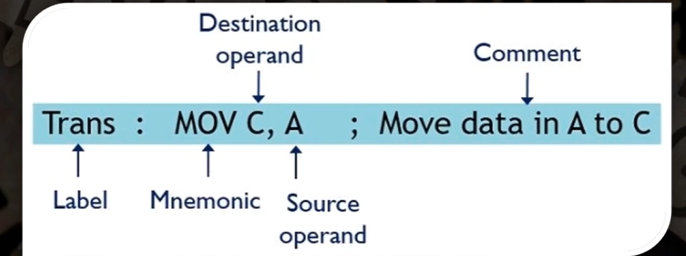
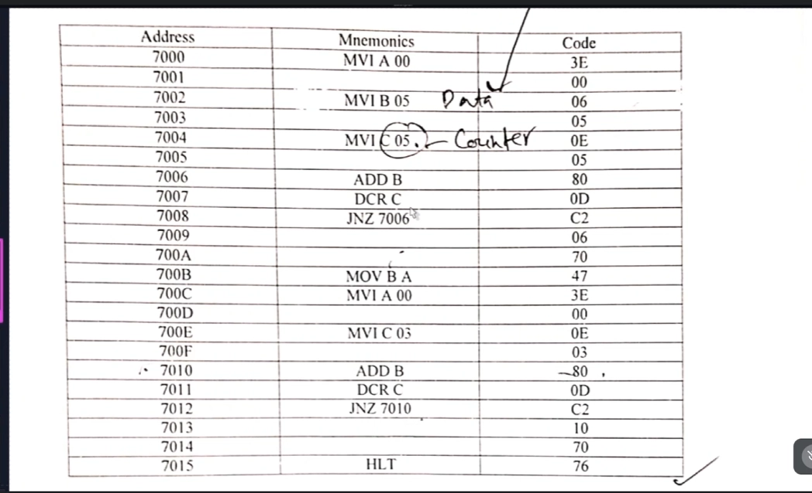

add execute permission : 

┌──(samin㉿kali)-[~/Documents/Tryhackme]
└─$ chmod +x crackme1          
                                                                                                                                                                                                                                           
┌──(samin㉿kali)-[~/Documents/Tryhackme]
└─$ ./crackme1       
flag{not_that_kind_of_elf}

http://unixwiz.net/techtips/x86-jumps.html 

========================================================

    Download the artifact from the next challenge.
    Disassemble it like you did for the previous challenge.
    Statically analyze it; read it, try to understand what is happening.

Notice how the code jumps backwards! The same block of code is executed multiple times. This is how a loop looks in assembly language. To statically figure out what is in eax at main+56 we’d have to precisely calculate how many times this loop runs. This is possible, but in this case, we can easily set a breakpoint to pause program execution after the loop. To set a breakpoint and examine eax, follow these steps:

    (gdb) break *main+59 This sets a breakpoint at the instruction immediately after the one in question. This guarantees that the instruction in question has actually been executed.
    (gdb) run This lets the program run until it tries to execute the instruction at our breakpoint.
    (gdb) info registers eax This prints out our answer in hexadecimal and decimal.
