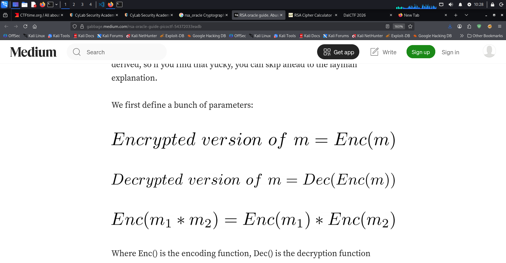

https://learn.cylabacademy.org/library/422  

Can you abuse the oracle?

An attacker was able to intercept communications between a bank and a fintech company. They managed to get the message
(ciphertext) and the password
that was used to encrypt the message.

PicoCtf/Cryptography/Medium/files/rsa_oracle

After some intensive reconassainance they found out that the bank has an oracle that was used to encrypt the password and can be found here nc titan.picoctf.net 59914. Decrypt the password and use it to decrypt the message. The oracle can decrypt anything except the password.

soln : 

https://primer.picoctf.org/#_asymmetric_crypto_example_rsa 
https://gabbage.medium.com/rsa-oracle-guide-picoctf-54372033eadb
https://yun.ng/c/ctf/picoctf/crypto/rsa_oracle

Looking at RSA decryption techniques

We’ll be using a bit of math syntax to illustrate how the decryption is derived, so if you find that yucky, you can skip ahead to the layman explanation.

Where Enc() is the encoding function, Dec() is the decryption function