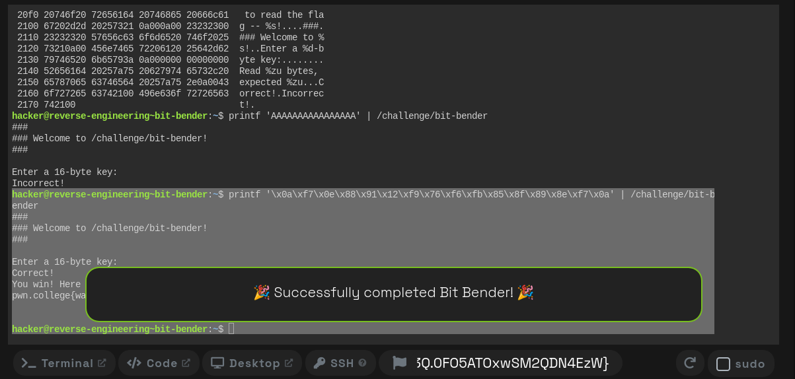

# Bit Bender — Reverse Engineering Write-Up

## Challenge Overview

The challenge binary is:

```bash
/challenge/bit-bender
```

The goal is to determine the correct **16-byte binary key** that causes the program to print:

```text
Correct!
```

and reveal the flag.

---

## 1. Initial Reconnaissance

First, run:

```bash
ltrace /challenge/bit-bender
```

The important part of the output is:

```text
printf("Enter a %d-byte key:\n", 16)
fread(..., 1, 16, ...)
```

This tells us that the program expects exactly **16 bytes** of input.

The binary also imports:

```text
memcmp
```

which suggests that the supplied key is probably transformed and then compared with an expected value.

---

## 2. Inspecting the Binary with `strings`

Running:

```bash
strings /challenge/bit-bender
```

reveals two interesting printable strings:

```text
jDrgyzHCH
BLauisDj
```

Combining them gives:

```text
jDrgyzHCBLauisDj
```

This is exactly 16 characters long, making it a strong candidate for the expected comparison value.

However, we need to inspect the disassembly to determine whether this is the actual key or the transformed value.

---

## 3. Examining `main`

Use:

```bash
objdump -d -M intel /challenge/bit-bender | grep -A150 '<main>:'
```

The important instructions are:

```asm
1497: movabs rax,0x43487a796772446a
14a1: movabs rdx,0x6a44736975614c42
14ab: mov    QWORD PTR [rbp-0x40],rax
14af: mov    QWORD PTR [rbp-0x38],rdx
```

These instructions construct the 16-byte expected value.

---

## 4. Recovering the Expected Value

The first constant is:

```text
0x43487a796772446a
```

Because x86-64 uses little-endian byte ordering, the bytes in memory are:

```text
6a 44 72 67 79 7a 48 43
```

which is ASCII:

```text
jDrgyzHC
```

The second constant is:

```text
0x6a44736975614c42
```

and is stored as:

```text
42 4c 61 75 69 73 44 6a
```

which is:

```text
BLauisDj
```

Therefore the complete expected value is:

```text
6a 44 72 67 79 7a 48 43 42 4c 61 75 69 73 44 6a
```

or:

```text
jDrgyzHCBLauisDj
```

---

## 5. Finding the Input Transformation

The key part of the disassembly is:

```asm
1550: movzx eax,BYTE PTR [rax]
1553: add    eax,0x2b
1556: mov    BYTE PTR [rbp-0x59],al

1559: movzx eax,BYTE PTR [rbp-0x59]
155d: shr    al,0x7

1563: movzx eax,BYTE PTR [rbp-0x59]
1567: add    eax,eax

156c: movzx edx,BYTE PTR [rbp-0x5c]
1570: movzx eax,BYTE PTR [rbp-0x5b]
1574: or     eax,edx
```

Let's translate this into simpler operations.

First:

```asm
add eax,0x2b
```

means:

```c
x = x + 0x2b;
```

Then:

```asm
shr al,0x7
```

extracts the most significant bit:

```c
high_bit = x >> 7;
```

Next:

```asm
add eax,eax
```

performs a left shift:

```c
shifted = x << 1;
```

Finally:

```asm
or eax,edx
```

combines the shifted value with the bit that was shifted out:

```c
result = (x << 1) | (x >> 7);
```

Because this operates on an 8-bit value, this is an 8-bit rotate-left operation:

```text
ROL8(x, 1)
```

Therefore the complete transformation is:

```text
result = ROL8(input + 0x2b, 1)
```

---

## 6. Understanding the Comparison

Later in `main`, we see:

```asm
1599: mov    rdx,QWORD PTR [rbp-0x50]
159d: lea    rcx,[rbp-0x40]
15a1: lea    rax,[rbp-0x20]
15a5: mov    rsi,rcx
15a8: mov    rdi,rax
15ab: call   11b0 <memcmp@plt>
```

This is effectively:

```c
memcmp(transformed_input, expected, 16);
```

So the challenge checks:

```text
ROL8(input[i] + 0x2b, 1) == expected[i]
```

for all 16 bytes.

The printable string:

```text
jDrgyzHCBLauisDj
```

is therefore the **expected transformed value**, not the original license key.

---

## 7. Reversing the Transformation

We have:

```text
ROL8(input + 0x2b, 1) = expected
```

To reverse a left rotation, perform a right rotation:

```text
input + 0x2b = ROR8(expected, 1)
```

Then subtract `0x2b`:

```text
input = ROR8(expected, 1) - 0x2b
```

This gives us the actual key.

---

## 8. Calculating the 16-Byte Key

The expected bytes are:

```text
6a 44 72 67 79 7a 48 43
42 4c 61 75 69 73 44 6a
```

Applying:

```text
input = ROR8(expected, 1) - 0x2b
```

gives:

| Expected | ROR8 by 1 | Subtract `0x2b` |  Key |
| -------- | --------: | --------------: | ---: |
| `6a`     |      `35` |            `0a` | `0a` |
| `44`     |      `22` |            `f7` | `f7` |
| `72`     |      `39` |            `0e` | `0e` |
| `67`     |      `b3` |            `88` | `88` |
| `79`     |      `bc` |            `91` | `91` |
| `7a`     |      `3d` |            `12` | `12` |
| `48`     |      `24` |            `f9` | `f9` |
| `43`     |      `a1` |            `76` | `76` |
| `42`     |      `21` |            `f6` | `f6` |
| `4c`     |      `26` |            `fb` | `fb` |
| `61`     |      `b0` |            `85` | `85` |
| `75`     |      `ba` |            `8f` | `8f` |
| `69`     |      `b4` |            `89` | `89` |
| `73`     |      `b9` |            `8e` | `8e` |
| `44`     |      `22` |            `f7` | `f7` |
| `6a`     |      `35` |            `0a` | `0a` |

Therefore the actual license key is:

```text
0a f7 0e 88 91 12 f9 76 f6 fb 85 8f 89 8e f7 0a
```

---

## 9. Why the Key Must Be Supplied as Binary

The recovered key contains many non-printable bytes:

```text
0a f7 0e 88 91 12 f9 76 f6 fb 85 8f 89 8e f7 0a
```

Therefore, it cannot simply be typed into the terminal.

The program uses:

```c
fread(buffer, 1, 16, stdin);
```

which allows arbitrary binary bytes.

We can use `printf` hexadecimal escapes to send the exact bytes:

```bash
printf '\x0a\xf7\x0e\x88\x91\x12\xf9\x76\xf6\xfb\x85\x8f\x89\x8e\xf7\x0a' | /challenge/bit-bender
```

---

## 10. Verification

Running the recovered key:

```bash
printf '\x0a\xf7\x0e\x88\x91\x12\xf9\x76\xf6\xfb\x85\x8f\x89\x8e\xf7\x0a' | /challenge/bit-bender
```

produces:

```text
###
### Welcome to /challenge/bit-bender!
###

Enter a 16-byte key:
Correct!
You win! Here is your flag:
pwn.college{wa64As3wO_jTdynQGRUgG-uZg3Q.0FO5ATOxwSM2QDN4EzW}
```

This confirms that the reverse-engineered key is correct.

---

## 11. Final Answer

### Expected transformed value

```text
jDrgyzHCBLauisDj
```

Hexadecimal:

```text
6a 44 72 67 79 7a 48 43 42 4c 61 75 69 73 44 6a
```

### Transformation

```text
ROL8(input + 0x2b, 1)
```

### Reverse transformation

```text
input = ROR8(expected, 1) - 0x2b
```

### Correct 16-byte key

```text
0a f7 0e 88 91 12 f9 76 f6 fb 85 8f 89 8e f7 0a
```

### Command

```bash
printf '\x0a\xf7\x0e\x88\x91\x12\xf9\x76\xf6\xfb\x85\x8f\x89\x8e\xf7\x0a' | /challenge/bit-bender
```

### Flag

```text
pwn.college{wa64As3wO_jTdynQGRUgG-uZg3Q.0FO5ATOxwSM2QDN4EzW}
```

## Key Takeaway

The important reverse-engineering insight is that the value visible in the binary:

```text
jDrgyzHCBLauisDj
```

is **not the key to submit**. The program transforms every input byte before comparing it.

By analyzing the assembly, we identified the transformation as:

```text
ROL8(byte + 0x2b, 1)
```

and reversed it to obtain the required binary key.

The successful execution confirms the analysis.


