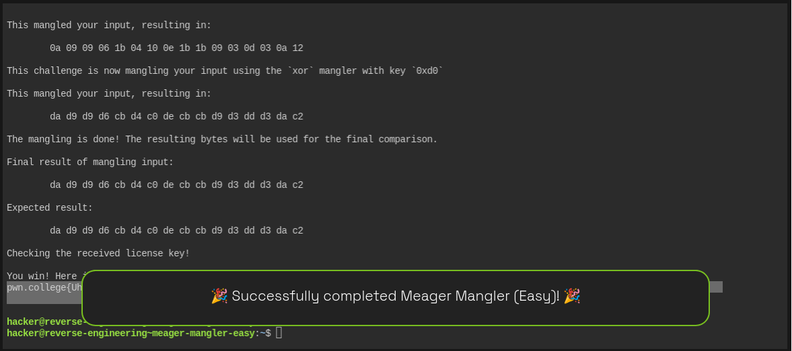

Input
  ↓
XOR with 0x61
  ↓
Reverse
  ↓
XOR with 0xd0
  ↓
Final result
  ↓
memcmp() with expected value


# Meager Mangler Easy — Full Reverse Engineering Write-up

## Challenge

Binary:

```bash
/challenge/meager-mangler-easy
```

The goal is to reverse engineer the transformations applied to the license key, recover the correct 16-byte input, and obtain the flag.

---

# 1. Initial Reconnaissance

First, confirm that the challenge binary exists:

```bash
ls /challenge/meager-mangler-easy
```

Output:

```text
/challenge/meager-mangler-easy
```

Next, use `strings` to look for useful information:

```bash
strings /challenge/meager-mangler-easy
```

Among the output, several strings immediately stand out:

```text
Initial input:
%02x
This challenge is now mangling your input using the `xor` mangler with key `0x61`
This challenge is now mangling your input using the `reverse` mangler.
This challenge is now mangling your input using the `xor` mangler with key `0xd0`
The mangling is done! The resulting bytes will be used for the final comparison.
Final result of mangling input:
Expected result:
Checking the received license key!
Wrong! No flag for you!
You win! Here is your flag:
```

This already gives us a major clue.

The program performs three transformations:

```text
Input
  |
  v
XOR with 0x61
  |
  v
Reverse
  |
  v
XOR with 0xd0
  |
  v
Final comparison
```

So instead of guessing the key, we can reverse these transformations.

---

# 2. Use `ltrace`

Run:

```bash
ltrace /challenge/meager-mangler-easy
```

Initially, we can just press Enter or provide some test input.

The important part of the output is:

```text
read(0, ..., 16) = ...
```

This tells us the program reads up to **16 bytes**.

The program also eventually calls:

```text
memcmp(..., ..., 16, ...) = ...
```

This is particularly important because `memcmp()` is comparing exactly 16 bytes.

Therefore:

```text
Required input size = 16 bytes
Comparison size     = 16 bytes
```

---

# 3. Identify the Mangling Operations

The program explicitly prints:

```text
This challenge is now mangling your input using the `xor` mangler with key `0x61`
```

Then:

```text
This challenge is now mangling your input using the `reverse` mangler.
```

Then:

```text
This challenge is now mangling your input using the `xor` mangler with key `0xd0`
```

Therefore the forward transformation is:

```text
INPUT
  |
  | XOR 0x61
  v
STEP 1
  |
  | REVERSE
  v
STEP 2
  |
  | XOR 0xd0
  v
FINAL RESULT
```

The program then compares the final result against a hard-coded expected value.

---

# 4. Extract the Expected Result

The `ltrace` output gives us:

```text
Expected result:

da d9 d9 d6 cb d4 c0 de cb cb d9 d3 dd d3 da c2
```

Therefore:

```text
EXPECTED =
da d9 d9 d6 cb d4 c0 de cb cb d9 d3 dd d3 da c2
```

These are 16 bytes:

```text
1:  da
2:  d9
3:  d9
4:  d6
5:  cb
6:  d4
7:  c0
8:  de
9:  cb
10: cb
11: d9
12: d3
13: dd
14: d3
15: da
16: c2
```

Our task is now:

> Find the original 16 bytes which become this sequence after the three mangling operations.

---

# 5. Understand XOR

The first and third operations are XOR operations.

The important property of XOR is:

```text
A XOR B XOR B = A
```

Therefore XOR is its own inverse.

For example:

```text
0x73 XOR 0x61 = 0x12
```

and:

```text
0x12 XOR 0x61 = 0x73
```

So if the program does:

```text
X XOR 0x61
```

we can undo it with:

```text
X XOR 0x61
```

Likewise, if the program does:

```text
X XOR 0xd0
```

we undo it with:

```text
X XOR 0xd0
```

This makes the challenge very easy to reverse.

---

# 6. Reverse the Final XOR `0xd0`

The last operation performed by the program is:

```text
XOR 0xd0
```

We know the final result:

```text
da d9 d9 d6 cb d4 c0 de cb cb d9 d3 dd d3 da c2
```

To undo the final XOR, XOR every byte with `0xd0`.

Calculate:

```text
da XOR d0 = 0a
d9 XOR d0 = 09
d9 XOR d0 = 09
d6 XOR d0 = 06
cb XOR d0 = 1b
d4 XOR d0 = 04
c0 XOR d0 = 10
de XOR d0 = 0e
cb XOR d0 = 1b
cb XOR d0 = 1b
d9 XOR d0 = 09
d3 XOR d0 = 03
dd XOR d0 = 0d
d3 XOR d0 = 03
da XOR d0 = 0a
c2 XOR d0 = 12
```

So after undoing the final XOR:

```text
0a 09 09 06 1b 04 10 0e 1b 1b 09 03 0d 03 0a 12
```

At this point, we have reversed the third operation.

---

# 7. Reverse the `reverse` Operation

The second operation was simply:

```text
reverse
```

Therefore, we reverse the bytes we just obtained.

Before:

```text
0a 09 09 06 1b 04 10 0e 1b 1b 09 03 0d 03 0a 12
```

After reversing:

```text
12 0a 03 0d 03 09 1b 1b 0e 10 04 1b 06 09 09 0a
```

Now we have undone two of the three operations.

---

# 8. Reverse the First XOR `0x61`

The first operation performed by the program was:

```text
input XOR 0x61
```

Again, XOR is its own inverse.

So XOR each byte with `0x61`.

```text
12 XOR 61 = 73
0a XOR 61 = 6b
03 XOR 61 = 62
0d XOR 61 = 6c
03 XOR 61 = 62
09 XOR 61 = 68
1b XOR 61 = 7a
1b XOR 61 = 7a
0e XOR 61 = 6f
10 XOR 61 = 71
04 XOR 61 = 65
1b XOR 61 = 7a
06 XOR 61 = 67
09 XOR 61 = 68
09 XOR 61 = 68
0a XOR 61 = 6b
```

Therefore the original key is:

```text
73 6b 62 6c 62 68 7a 7a 6f 71 65 7a 67 68 68 6b
```

---

# 9. Convert the Key from Hex to ASCII

Convert each byte:

```text
73 = s
6b = k
62 = b
6c = l
62 = b
68 = h
7a = z
7a = z
6f = o
71 = q
65 = e
7a = z
67 = g
68 = h
68 = h
6b = k
```

Therefore:

```text
skblbhzzoqezghhk
```

This is exactly 16 characters:

```text
s k b l b h z z o q e z g h h k
```

So our candidate license key is:

```text
skblbhzzoqezghhk
```

---

# 10. Verify the Key Manually

We can verify that our recovered key actually produces the expected result.

Our input:

```text
skblbhzzoqezghhk
```

Hex:

```text
73 6b 62 6c 62 68 7a 7a 6f 71 65 7a 67 68 68 6b
```

## Step 1 — XOR with `0x61`

```text
73 XOR 61 = 12
6b XOR 61 = 0a
62 XOR 61 = 03
6c XOR 61 = 0d
62 XOR 61 = 03
68 XOR 61 = 09
7a XOR 61 = 1b
7a XOR 61 = 1b
6f XOR 61 = 0e
71 XOR 61 = 10
65 XOR 61 = 04
7a XOR 61 = 1b
67 XOR 61 = 06
68 XOR 61 = 09
68 XOR 61 = 09
6b XOR 61 = 0a
```

Result:

```text
12 0a 03 0d 03 09 1b 1b 0e 10 04 1b 06 09 09 0a
```

---

## Step 2 — Reverse

Reverse the bytes:

```text
0a 09 09 06 1b 04 10 0e 1b 1b 09 03 0d 03 0a 12
```

---

## Step 3 — XOR with `0xd0`

```text
0a XOR d0 = da
09 XOR d0 = d9
09 XOR d0 = d9
06 XOR d0 = d6
1b XOR d0 = cb
04 XOR d0 = d4
10 XOR d0 = c0
0e XOR d0 = de
1b XOR d0 = cb
1b XOR d0 = cb
09 XOR d0 = d9
03 XOR d0 = d3
0d XOR d0 = dd
03 XOR d0 = d3
0a XOR d0 = da
12 XOR d0 = c2
```

Final result:

```text
da d9 d9 d6 cb d4 c0 de cb cb d9 d3 dd d3 da c2
```

Compare this with the expected result:

```text
da d9 d9 d6 cb d4 c0 de cb cb d9 d3 dd d3 da c2
```

They are identical.

Therefore the key is correct.

---

# 11. Submit the Key

Run the challenge:

```bash
/challenge/meager-mangler-easy
```

Enter:

```text
skblbhzzoqezghhk
```

The program should show:

```text
Initial input:

        73 6b 62 6c 62 68 7a 7a 6f 71 65 7a 67 68 68 6b
```

After XOR `0x61`:

```text
12 0a 03 0d 03 09 1b 1b 0e 10 04 1b 06 09 09 0a
```

After reverse:

```text
0a 09 09 06 1b 04 10 0e 1b 1b 09 03 0d 03 0a 12
```

After XOR `0xd0`:

```text
da d9 d9 d6 cb d4 c0 de cb cb d9 d3 dd d3 da c2
```

And the expected result is:

```text
da d9 d9 d6 cb d4 c0 de cb cb d9 d3 dd d3 da c2
```

The comparison succeeds.

---

# 12. Successful Execution

The successful run was:

```text
hacker@reverse-engineering~meager-mangler-easy:~$ /challenge/meager-mangler-easy

###
### Welcome to /challenge/meager-mangler-easy!
###

This license verifier software will allow you to read the flag. However, before you can do so, you must verify that you
are licensed to read flag files! This program consumes a license key over stdin. Each program may perform entirely
different operations on that input! You must figure out (by reverse engineering this program) what that license key is.
Providing the correct license key will net you the flag!

Ready to receive your license key!

skblbhzzoqezghhk
```

The program produces:

```text
Initial input:

        73 6b 62 6c 62 68 7a 7a 6f 71 65 7a 67 68 68 6b

This challenge is now mangling your input using the `xor` mangler with key `0x61`

This mangled your input, resulting in:

        12 0a 03 0d 03 09 1b 1b 0e 10 04 1b 06 09 09 0a

This challenge is now mangling your input using the `reverse` mangler.

This mangled your input, resulting in:

        0a 09 09 06 1b 04 10 0e 1b 1b 09 03 0d 03 0a 12

This challenge is now mangling your input using the `xor` mangler with key `0xd0`

This mangled your input, resulting in:

        da d9 d9 d6 cb d4 c0 de cb cb d9 d3 dd d3 da c2

The mangling is done! The resulting bytes will be used for the final comparison.

Final result of mangling input:

        da d9 d9 d6 cb d4 c0 de cb cb d9 d3 dd d3 da c2

Expected result:

        da d9 d9 d6 cb d4 c0 de cb cb d9 d3 dd d3 da c2

Checking the received license key!

You win! Here is your flag:
pwn.college{UhJkEe1F_bcPRtWmzk-rYSJ3O72.dFjNywSM2QDN4EzW}
```

---

# 13. Complete Solution in One Command

Because the key is printable ASCII, we can simply pipe it into the challenge:

```bash
printf 'skblbhzzoqezghhk' | /challenge/meager-mangler-easy
```

Or run it normally:

```bash
/challenge/meager-mangler-easy
```

and type:

```text
skblbhzzoqezghhk
```

---

# 14. Reverse-Engineering Summary

The program performs the following transformation:

```text
INPUT
  |
  | XOR 0x61
  v
STEP 1
  |
  | REVERSE
  v
STEP 2
  |
  | XOR 0xd0
  v
FINAL RESULT
```

The expected final result is:

```text
da d9 d9 d6 cb d4 c0 de cb cb d9 d3 dd d3 da c2
```

To recover the input, reverse the operations:

```text
EXPECTED
   |
   | XOR 0xd0
   v
   |
   | REVERSE
   v
   |
   | XOR 0x61
   v
ORIGINAL INPUT
```

This gives:

```text
Hex:

73 6b 62 6c 62 68 7a 7a
6f 71 65 7a 67 68 68 6b
```

ASCII:

```text
skblbhzzoqezghhk
```

---

# 15. Final Answer

## License Key

```text
skblbhzzoqezghhk
```

## Key in Hex

```text
736b626c62687a7a6f71657a6768686b
```

## Expected Final Result

```text
dad9d9d6cbd4c0decb cbd9d3ddd3dac2
```

Without the spacing:

```text
dad9d9d6cbd4c0decbcbd9d3ddd3dac2
```

## Flag

```text
pwn.college{UhJkEe1F_bcPRtWmzk-rYSJ3O72.dFjNywSM2QDN4EzW}
```

---

# 16. Key Lessons

This challenge demonstrates several useful reverse-engineering concepts:

### 1. `strings` can reveal program logic

The strings immediately exposed:

```text
xor 0x61
reverse
xor 0xd0
```

which significantly reduced the amount of assembly analysis required.

### 2. `ltrace` reveals library calls

The `read()` and `memcmp()` calls showed that:

```text
16 bytes
```

are read and compared.

### 3. XOR is reversible

The most important property is:

```text
A XOR B XOR B = A
```

Therefore:

```text
X XOR key
```

can always be undone with:

```text
X XOR key
```

### 4. Reverse operations in reverse order

If the program does:

```text
A → XOR 0x61 → REVERSE → XOR 0xd0 → RESULT
```

then solving it requires:

```text
RESULT → XOR 0xd0 → REVERSE → XOR 0x61 → A
```

This is the central idea of the challenge.

### 5. Always verify your recovered key

After deriving the key, run it through the actual binary and confirm that the generated result exactly matches the expected value.

In this case:

```text
Generated:

da d9 d9 d6 cb d4 c0 de cb cb d9 d3 dd d3 da c2

Expected:

da d9 d9 d6 cb d4 c0 de cb cb d9 d3 dd d3 da c2
```

They match, resulting in:

```text
You win!
```

and the flag.

```text
pwn.college{UhJkEe1F_bcPRtWmzk-rYSJ3O72.dFjNywSM2QDN4EzW}
```




