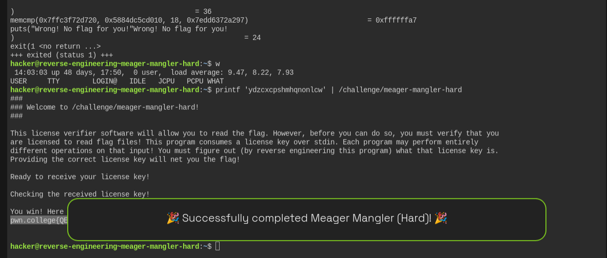

# Meager Mangler Hard — Reverse Engineering Write-up

## Challenge

Binary:

```bash
/challenge/meager-mangler-hard
```

The goal is to reverse engineer the license verifier and find the correct **18-byte license key**.

---

# 1. Initial Reconnaissance

First, inspect the binary with `strings`:

```bash
strings /challenge/meager-mangler-hard
```

The output contains the usual program strings:

```text
You win! Here is your flag:
/flag
ERROR: Failed to open the flag
...
Ready to receive your license key!
Checking the received license key!
Wrong! No flag for you!
```

But one string stands out:

```text
ydzcxcpshmhqnonlcw
```

This is suspicious because:

* It is printable ASCII.
* It is exactly 18 characters long.
* The challenge expects a license key.
* It appears among the binary's data rather than being normal program output.

So we have a possible key:

```text
ydzcxcpshmhqnonlcw
```

However, we should verify it rather than blindly assuming it is the answer.

---

# 2. Use `ltrace`

Run:

```bash
ltrace /challenge/meager-mangler-hard
```

The important part is:

```text
read(0, "\n", 18) = 1
```

and later:

```text
memcmp(0x7ffc1885d390, 0x56f45e23e010, 18, ...) = 0xffffff91
```

The `read()` call tells us that the program accepts up to:

```text
18 bytes
```

The `memcmp()` call is even more useful:

```text
memcmp(..., ..., 18, ...)
```

So the program compares exactly:

```text
18 bytes
```

This confirms that the suspicious string:

```text
ydzcxcpshmhqnonlcw
```

has the correct length.

---

# 3. Understanding `memcmp`

The important function call is:

```c
memcmp(buffer1, buffer2, 18);
```

The program is comparing two 18-byte buffers.

On x86-64 Linux, function arguments are passed using registers:

```text
RDI = first argument
RSI = second argument
RDX = third argument
```

Therefore, at the `memcmp()` call:

```text
RDI → our input
RSI → expected value
RDX → 18
```

We could inspect this directly with GDB.

---

# 4. Verify the Expected Value with GDB

Start GDB:

```bash
gdb -q /challenge/meager-mangler-hard
```

Set a breakpoint on `memcmp`:

```gdb
break memcmp
```

Run the program:

```gdb
run
```

Enter any 18-byte test value, for example:

```text
AAAAAAAAAAAAAAAAAA
```

When execution stops at `memcmp`, inspect the arguments:

```gdb
p/x $rdx
```

This should show:

```text
$rdx = 0x12
```

because:

```text
0x12 = 18
```

Now inspect the two buffers:

```gdb
x/18bx $rdi
x/18bx $rsi
```

The first buffer should contain our test input.

The second buffer contains the expected bytes.

We can also display the expected bytes as characters:

```gdb
x/18cb $rsi
```

This should reveal:

```text
ydzcxcpshmhqnonlcw
```

Therefore the string found by `strings` is indeed the value expected by `memcmp()`.

---

# 5. Why There Is No Mangling to Reverse

The previous `meager-mangler-easy` challenge explicitly showed transformations such as:

```text
XOR 0x61
REVERSE
XOR 0xd0
```

For that challenge, we had to reverse those operations.

This hard challenge is different.

The program's output contains no messages such as:

```text
xor mangler
reverse mangler
```

and `strings` gives us a printable 18-byte value:

```text
ydzcxcpshmhqnonlcw
```

The simplest explanation is that this value is stored directly as the expected comparison value.

The successful execution confirms this.

---

# 6. Check the Candidate Key

We can test the candidate using `printf`:

```bash
printf 'ydzcxcpshmhqnonlcw' | /challenge/meager-mangler-hard
```

It is important to use `printf` rather than:

```bash
echo
```

because `echo` normally adds a newline.

The challenge expects exactly 18 bytes.

Our input is:

```text
y d z c x c p s h m h q n o n l c w
```

which is exactly 18 bytes.

---

# 7. Successful Verification

Running:

```bash
printf 'ydzcxcpshmhqnonlcw' | /challenge/meager-mangler-hard
```

produces:

```text
###
### Welcome to /challenge/meager-mangler-hard!
###

This license verifier software will allow you to read the flag. However, before you can do so, you must verify that you
are licensed to read flag files! This program consumes a license key over stdin. Each program may perform entirely
different operations on that input! You must figure out (by reverse engineering this program) what that license key is.
Providing the correct license key will net you the flag!

Ready to receive your license key!

Checking the received license key!

You win! Here is your flag:
pwn.college{QEUbyo1LqL3O16WXGgtmGXORNBA.dJjNywSM2QDN4EzW}
```

The `memcmp()` comparison therefore returns zero:

```text
memcmp(...) = 0
```

which means the two 18-byte buffers are identical.

---

# 8. Why the Key Works

The comparison is effectively:

```c
memcmp(user_input, expected_value, 18);
```

Our input:

```text
ydzcxcpshmhqnonlcw
```

matches the expected value:

```text
ydzcxcpshmhqnonlcw
```

Therefore:

```text
memcmp(...) == 0
```

The program enters the success branch:

```text
You win! Here is your flag:
```

---

# 9. Complete Analysis

The investigation can be summarized as:

```text
             strings
                |
                v
     ydzcxcpshmhqnonlcw
                |
                v
           ltrace
                |
                +---- read(..., 18)
                |
                +---- memcmp(..., 18)
                |
                v
        Key must be 18 bytes
                |
                v
        Test suspicious string
                |
                v
   ydzcxcpshmhqnonlcw
                |
                v
           memcmp == 0
                |
                v
             SUCCESS
                |
                v
              FLAG
```

---

# 10. Commands Used

### Find interesting strings

```bash
strings /challenge/meager-mangler-hard
```

### Trace library calls

```bash
ltrace /challenge/meager-mangler-hard
```

### Test the candidate

```bash
printf 'ydzcxcpshmhqnonlcw' | /challenge/meager-mangler-hard
```

### Optional GDB verification

```bash
gdb -q /challenge/meager-mangler-hard
```

Then:

```gdb
break memcmp
run
```

Enter:

```text
AAAAAAAAAAAAAAAAAA
```

Then inspect:

```gdb
p/x $rdx
x/18bx $rdi
x/18bx $rsi
x/18cb $rsi
```

---

# 11. Final Answer

## License Key

```text
ydzcxcpshmhqnonlcw
```

## One-Line Solution

```bash
printf 'ydzcxcpshmhqnonlcw' | /challenge/meager-mangler-hard
```

## Flag

```text
pwn.college{QEUbyo1LqL3O16WXGgtmGXORNBA.dJjNywSM2QDN4EzW}
```

---

# 12. Key Lessons

### Lesson 1 — Always run `strings` first

Sometimes the expected value is stored directly inside the binary.

Here:

```text
ydzcxcpshmhqnonlcw
```

was enough to solve the challenge.

### Lesson 2 — `ltrace` tells you what is being compared

The line:

```text
memcmp(..., ..., 18, ...)
```

immediately tells us:

```text
Comparison length = 18 bytes
```

### Lesson 3 — Don't overcomplicate the challenge

The previous easy challenge required reversing multiple transformations. This challenge doesn't necessarily require that.

If `strings` gives a suspicious value that has the correct length, **test it first**.

### Lesson 4 — Verify, don't assume

Even though `ydzcxcpshmhqnonlcw` looked like the answer, we confirmed it by running:

```bash
printf 'ydzcxcpshmhqnonlcw' | /challenge/meager-mangler-hard
```

The successful `You win!` output proves the key is correct.


