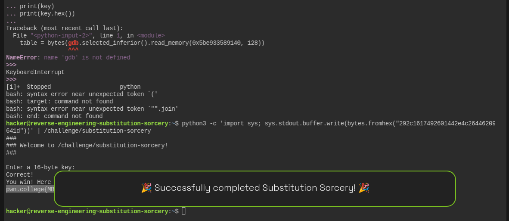

````markdown
# Substitution Sorcery — Reverse Engineering Write-up

## Challenge

Binary:

```bash
/challenge/substitution-sorcery
````

The goal is to reverse engineer the key verification logic, recover the required 16-byte binary key, and obtain the flag.

---

## 1. Initial Investigation with `ltrace`

Start by running:

```bash
ltrace /challenge/substitution-sorcery
```

The important part of the output is:

```text
printf("Enter a %d-byte key:\n", 16)
Enter a 16-byte key:

fread(..., 1, 16, ...)
```

This tells us:

* The program expects a **16-byte key**.
* Input is read using `fread()`.
* `fread()` can read arbitrary binary bytes, so the key does not necessarily have to contain printable characters.
* There is no obvious `strcmp()` visible from the initial `ltrace` output.

Because the verification appears to be implemented manually, we move to GDB.

---

## 2. Start GDB

Launch the binary with GDB:

```bash
gdb -q /challenge/substitution-sorcery
```

Set Intel syntax:

```gdb
set disassembly-flavor intel
```

Set a breakpoint at `main`:

```gdb
break main
```

Run the program:

```gdb
run
```

Then disassemble `main`:

```gdb
disassemble main
```

---

## 3. Find the Hard-Coded Expected Value

Early in `main`, we find:

```asm
mov    QWORD PTR [rbp-0x50],0x10

movabs rax,0x746d6c4b6f577959
movabs rdx,0x42544565746c554a

mov    QWORD PTR [rbp-0x40],rax
mov    QWORD PTR [rbp-0x38],rdx
```

The two constants are:

```text
0x746d6c4b6f577959
0x42544565746c554a
```

Because x86-64 uses little-endian byte ordering, we need to reverse the byte order of each 64-bit value when interpreting the bytes in memory.

### First constant

```text
0x746d6c4b6f577959
```

In memory:

```text
59 79 57 6f 4b 6c 6d 74
```

ASCII:

```text
YyWoKlmt
```

### Second constant

```text
0x42544565746c554a
```

In memory:

```text
4a 55 6c 74 65 45 54 42
```

ASCII:

```text
JUlteETB
```

Therefore, the 16-byte expected value is:

```text
YyWoKlmtJUlteETB
```

This is important, but it is **not yet the key**. The program transforms our input before comparing it to this value.

---

## 4. Find the Input Buffer

The input is read using:

```asm
lea    rax,[rbp-0x30]
mov    esi,0x1
mov    rdi,rax
call   fread@plt
```

Therefore, the input buffer is located at:

```text
[rbp-0x30]
```

The program reads:

```text
16 × 1-byte elements
```

into this buffer.

After `fread()`, the return value is checked:

```asm
mov    rax,QWORD PTR [rbp-0x48]
cmp    rax,QWORD PTR [rbp-0x50]
je     ...
```

Earlier we saw:

```asm
mov QWORD PTR [rbp-0x50],0x10
```

so this effectively checks:

```c
if (bytes_read != 16)
    fail();
```

Therefore, exactly 16 bytes must be supplied.

---

## 5. Find the Transformation Loop

After checking the input length, the program initializes a counter:

```asm
mov    QWORD PTR [rbp-0x58],0x0
```

This corresponds to:

```c
i = 0;
```

The loop contains:

```asm
lea    rdx,[rbp-0x30]
mov    rax,QWORD PTR [rbp-0x58]
add    rax,rdx
movzx  eax,BYTE PTR [rax]

and    eax,0x7f
mov    BYTE PTR [rbp-0x5a],al
```

This can be translated to:

```c
c = input[i] & 0x7f;
```

The `0x7f` mask means that only the lower 7 bits of each input byte are used.

---

## 6. Discover the Substitution Table

The next important instructions are:

```asm
movzx  eax,BYTE PTR [rbp-0x5a]
movzx  eax,al
cdqe

lea    rdx,[rip+0xbd7]        # 0x...9140 <d>

movzx  eax,BYTE PTR [rax+rdx*1]
```

This means the program uses the processed input byte as an index into a table named `d`.

In C-like pseudocode:

```c
output[i] = d[input[i] & 0x7f];
```

The substitution table begins at:

```text
0x5be933589140
```

Therefore, the core transformation is:

```text
input byte
    |
    v
input[i] & 0x7f
    |
    v
d[index]
    |
    v
transformed byte
```

---

## 7. Dump the Substitution Table

In GDB:

```gdb
x/128bx 0x5be933589140
```

The table is:

```text
0x28 0x6d 0x22 0x35 0x10 0x2c 0x78 0x12
0x0b 0x45 0x4e 0x31 0x02 0x24 0x7b 0x7e
0x66 0x75 0x1c 0x30 0x46 0x50 0x57 0x6f
0x4c 0x23 0x77 0x6b 0x7d 0x42 0x61 0x19
0x01 0x4f 0x00 0x5c 0x11 0x1e 0x6c 0x3b
0x40 0x59 0x37 0x7f 0x79 0x17 0x4a 0x3c
0x44 0x3d 0x0c 0x18 0x5d 0x48 0x21 0x49
0x7a 0x64 0x0a 0x3e 0x2b 0x0d 0x25 0x29
0x06 0x5e 0x53 0x2d 0x74 0x6e 0x69 0x58
0x2f 0x4b 0x26 0x09 0x55 0x27 0x47 0x13
0x62 0x3a 0x33 0x07 0x68 0x0f 0x7c 0x63
0x52 0x56 0x2a 0x73 0x76 0x67 0x39 0x1a
0x72 0x15 0x65 0x36 0x54 0x08 0x5a 0x1f
0x32 0x05 0x5b 0x6a 0x43 0x03 0x16 0x4d
0x20 0x0e 0x60 0x14 0x1d 0x38 0x2e 0x70
0x34 0x3f 0x71 0x1b 0x51 0x04 0x5f 0x41
```

There are exactly 128 entries, which matches the `0x7f` mask.

---

## 8. Find the Final Comparison

After processing all 16 bytes, the program calls:

```asm
mov    rdx,QWORD PTR [rbp-0x50]
lea    rcx,[rbp-0x40]
lea    rax,[rbp-0x20]

mov    rsi,rcx
mov    rdi,rax

call   memcmp@plt
```

On x86-64 Linux, function arguments are passed as:

```text
RDI = first argument
RSI = second argument
RDX = third argument
```

Therefore the call is equivalent to:

```c
memcmp(transformed, expected, 16);
```

The result is then checked:

```asm
test   eax,eax
jne    failure
```

If `memcmp()` returns zero, the program executes:

```asm
call win
```

So the condition for success is:

```text
transformed == YyWoKlmtJUlteETB
```

---

## 9. Reverse the Substitution

The program performs:

```text
input[i]
    |
    v
input[i] & 0x7f
    |
    v
d[index]
    |
    v
expected[i]
```

We know the expected output:

```text
YyWoKlmtJUlteETB
```

Therefore, instead of trying to guess the input, we can reverse the substitution table.

For every expected byte, we find the index where that byte occurs in `d`.

In other words:

```text
expected byte
      |
      v
search d[]
      |
      v
index = required input byte
```

---

## 10. Calculate the Required Key

The expected string is:

```text
Y y W o K l m t J U l t e E T B
```

Hexadecimal:

```text
59 79 57 6f 4b 6c 6d 74 4a 55 6c 74 65 45 54 42
```

Searching the substitution table gives:

| Expected | Hex  | Index in `d` |
| -------- | ---- | ------------ |
| `Y`      | `59` | `29`         |
| `y`      | `79` | `2c`         |
| `W`      | `57` | `16`         |
| `o`      | `6f` | `17`         |
| `K`      | `4b` | `49`         |
| `l`      | `6c` | `26`         |
| `m`      | `6d` | `01`         |
| `t`      | `74` | `44`         |
| `J`      | `4a` | `2e`         |
| `U`      | `55` | `4c`         |
| `l`      | `6c` | `26`         |
| `t`      | `74` | `44`         |
| `e`      | `65` | `62`         |
| `E`      | `45` | `09`         |
| `T`      | `54` | `64`         |
| `B`      | `42` | `1d`         |

Therefore the required 16-byte key is:

```text
29 2c 16 17 49 26 01 44 2e 4c 26 44 62 09 64 1d
```

---

## 11. Why the Key Must Be Supplied as Binary

The key is **not** the ASCII string:

```text
292c1617492601442e4c26446209641d
```

That would be 32 bytes.

The actual key is exactly 16 raw bytes:

```text
29 2c 16 17 49 26 01 44 2e 4c 26 44 62 09 64 1d
```

Some bytes are non-printable:

```text
0x16
0x01
0x09
```

Therefore, we should generate the key as binary data rather than trying to type it into the terminal.

---

## 12. Generate the Binary Key

From the normal shell:

```bash
python3 -c 'import sys; sys.stdout.buffer.write(bytes.fromhex("292c1617492601442e4c26446209641d"))' > /tmp/key
```

Verify the size:

```bash
wc -c /tmp/key
```

Expected:

```text
16 /tmp/key
```

We can also inspect it with:

```bash
xxd /tmp/key
```

Expected:

```text
00000000: 292c 1617 4926 0144 2e4c 2644 6209 641d
```

---

## 13. Submit the Key

Run:

```bash
/tmp/key | /challenge/substitution-sorcery
```

Or use the complete one-line command:

```bash
python3 -c 'import sys; sys.stdout.buffer.write(bytes.fromhex("292c1617492601442e4c26446209641d"))' | /challenge/substitution-sorcery
```

---

## 14. Successful Execution

The command successfully produces:

```text
###
### Welcome to /challenge/substitution-sorcery!
###

Enter a 16-byte key:
Correct!
You win! Here is your flag:
pwn.college{MB_AJttwx0OgRYNuwjAFvjjNC3Z.0VO5ATOxwSM2QDN4EzW}
```

The `Correct!` message confirms that the recovered binary key is valid.

The `You win!` message confirms that the verification succeeded and the `win()` function was reached.

---

## 15. Verify the Transformation

We can verify the first few bytes manually.

### First byte

Input:

```text
0x29
```

The table contains:

```text
d[0x29] = 0x59
```

`0x59` is ASCII:

```text
Y
```

### Second byte

Input:

```text
0x2c
```

The table contains:

```text
d[0x2c] = 0x79
```

`0x79` is:

```text
y
```

### Third byte

Input:

```text
0x16
```

The table contains:

```text
d[0x16] = 0x57
```

`0x57` is:

```text
W
```

### Fourth byte

Input:

```text
0x17
```

The table contains:

```text
d[0x17] = 0x6f
```

`0x6f` is:

```text
o
```

Therefore:

```text
Input:
29 2c 16 17 ...

       ↓ d[]

Output:
59 79 57 6f ...

       ↓ ASCII

Y y W o ...
```

Doing this for all 16 bytes produces:

```text
YyWoKlmtJUlteETB
```

which exactly matches the expected value.

---

## 16. Reconstructed Program Logic

After reverse engineering the assembly, the important part of the program can be represented with the following pseudocode:

```c
unsigned char input[16];
unsigned char transformed[16];

unsigned char expected[16] = {
    'Y', 'y', 'W', 'o',
    'K', 'l', 'm', 't',
    'J', 'U', 'l', 't',
    'e', 'E', 'T', 'B'
};

fread(input, 1, 16, stdin);

for (int i = 0; i < 16; i++) {
    unsigned char index = input[i] & 0x7f;
    transformed[i] = d[index];
}

if (memcmp(transformed, expected, 16) == 0) {
    win();
} else {
    puts("Wrong!");
}
```

The important equation is:

```text
d[input[i] & 0x7f] = expected[i]
```

We solve this by finding the inverse of `d`.

---

## 17. Complete Solution

The final binary key is:

```text
29 2c 16 17 49 26 01 44 2e 4c 26 44 62 09 64 1d
```

Hex representation:

```text
292c1617492601442e4c26446209641d
```

The complete solve command is:

```bash
python3 -c 'import sys; sys.stdout.buffer.write(bytes.fromhex("292c1617492601442e4c26446209641d"))' | /challenge/substitution-sorcery
```

---

## 18. Flag

The flag obtained after successful verification is:

```text
pwn.college{MB_AJttwx0OgRYNuwjAFvjjNC3Z.0VO5ATOxwSM2QDN4EzW}
```

---

## 19. Key Takeaways

The main reverse-engineering techniques used in this challenge were:

1. **Use `ltrace`** to identify input functions such as `fread()` and determine the expected input size.

2. **Use GDB** to disassemble `main()` and understand the verification logic.

3. **Recognize little-endian values** when decoding hard-coded 64-bit constants.

4. **Identify the substitution operation**:

   ```c
   transformed[i] = d[input[i] & 0x7f];
   ```

5. **Dump the substitution table** with:

   ```gdb
   x/128bx 0x5be933589140
   ```

6. **Identify the final `memcmp()`** and determine that the transformed input must equal:

   ```text
   YyWoKlmtJUlteETB
   ```

7. **Invert the substitution table** rather than guessing the key.

8. **Recognize that the resulting key is binary**, so it must be piped into the program rather than typed normally.

9. The final key is:

   ```text
   292c1617492601442e4c26446209641d
   ```

10. Successful execution gives:

```text
pwn.college{MB_AJttwx0OgRYNuwjAFvjjNC3Z.0VO5ATOxwSM2QDN4EzW}
```




