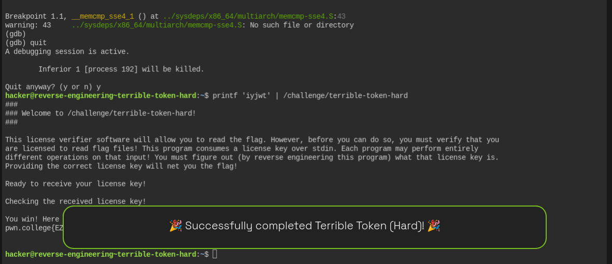

┌──(samin㉿kali)-[~]
└─$ssh -i key hacker@dojo.pwn.college.
The authenticity of host 'dojo.pwn.college. (206.206.192.59)' can't be established.
ED25519 key fingerprint is: SHA256:B31DzslH7ThPQFDntu6WpMf0q+YmRG4i6qamH/zkz1A
This host key is known by the following other names/addresses:
    ~/.ssh/known_hosts:7: [hashed name]
Are you sure you want to continue connecting (yes/no/[fingerprint])? yes
Warning: Permanently added 'dojo.pwn.college.' (ED25519) to the list of known hosts.
Connected!   

## hacker@reverse-engineering~terrible-token-hard:~$ strings /challenge/terrible-token-hard

/lib64/ld-linux-x86-64.so.2
mgUa
libc.so.6
exit
puts
putchar
stdin
printf
__errno_location
read
memcmp
stdout
geteuid
open
__cxa_finalize
setvbuf
strerror
__libc_start_main
write
GLIBC_2.2.5
_ITM_deregisterTMCloneTable
__gmon_start__
_ITM_registerTMCloneTable
u+UH
[]A\A]A^A_
You win! Here is your flag:
/flag
  ERROR: Failed to open the flag -- %s!
  Your effective user id is not 0!
  You must directly run the suid binary in order to have the correct permissions!
  ERROR: Failed to read the flag -- %s!
### Welcome to %s!
This license verifier software will allow you to read the flag. However, before you can do so, you must verify that you
are licensed to read flag files! This program consumes a license key over stdin. Each program may perform entirely
different operations on that input! You must figure out (by reverse engineering this program) what that license key is.
Providing the correct license key will net you the flag!
Ready to receive your license key!
Checking the received license key!
Wrong! No flag for you!
:*3$"
iyjwt
GCC: (Ubuntu 9.4.0-1ubuntu1~20.04.2) 9.4.0
.shstrtab
.interp
.note.gnu.property
.note.gnu.build-id
.note.ABI-tag
.gnu.hash
.dynsym
.dynstr
.gnu.version
.gnu.version_r
.rela.dyn
.rela.plt
.init
.plt.got
.plt.sec
.text
.fini


## hacker@reverse-engineering~terrible-token-hard:~$ ltrace /challenge/terrible-token-hard 

setvbuf(0x714266df0980, nil, 2, 0)                                                     = 0
setvbuf(0x714266df16a0, nil, 2, 0)                                                     = 0
puts("###"###
)                                                                            = 4
printf("### Welcome to %s!\n", "/challenge/terrible-token-hard"### Welcome to /challenge/terrible-token-hard!
)                       = 47
puts("###"###
)                                                                            = 4
putchar(10, 0x714266df1723, 0, 0x714266d12297
)                                         = 10
puts("This license verifier software w"...This license verifier software will allow you to read the flag. However, before you can do so, you must verify that you
)                                            = 120
puts("are licensed to read flag files!"...are licensed to read flag files! This program consumes a license key over stdin. Each program may perform entirely
)                                            = 115
puts("different operations on that inp"...different operations on that input! You must figure out (by reverse engineering this program) what that license key is.
)                                            = 120
puts("Providing the correct license ke"...Providing the correct license key will net you the flag!

)                                            = 58
puts("Ready to receive your license ke"...Ready to receive your license key!

)                                            = 36
read(0
, "\n", 5)                                                                       = 1
puts("Checking the received license ke"...Checking the received license key!

)                                            = 36
memcmp(0x7ffc1593a342, 0x5f90fc778010, 5, 0x714266d12297)                              = 0xffffffa1
puts("Wrong! No flag for you!"Wrong! No flag for you!
)                                                        = 24
exit(1 <no return ...>
+++ exited (status 1) +++


## hacker@reverse-engineering~terrible-token-hard:~$ gdb -q /challenge/terrible-token-hard
Reading symbols from /challenge/terrible-token-hard...
(No debugging symbols found in /challenge/terrible-token-hard)
(gdb) break memcmp
Breakpoint 1 at 0x1170
(gdb) run
Starting program: /challenge/terrible-token-hard 
###
### Welcome to /challenge/terrible-token-hard!
###

This license verifier software will allow you to read the flag. However, before you can do so, you must verify that you
are licensed to read flag files! This program consumes a license key over stdin. Each program may perform entirely
different operations on that input! You must figure out (by reverse engineering this program) what that license key is.
Providing the correct license key will net you the flag!

Ready to receive your license key!

cccccccccccccccccccccc
Checking the received license key!


Breakpoint 1.1, __memcmp_sse4_1 () at ../sysdeps/x86_64/multiarch/memcmp-sse4.S:43
warning: 43     ../sysdeps/x86_64/multiarch/memcmp-sse4.S: No such file or directory
(gdb) ccccccccccccccccc
Undefined command: "ccccccccccccccccc".  Try "help".
(gdb) x/5bx $rdi
0x7fff216585b2: 0x63    0x63    0x63    0x63    0x63
(gdb) x/5bx $rsi
0x5e1c520d7010: 0x69    0x79    0x6a    0x77    0x74
(gdb) quit 

``
I found the expected 5 bytes:

```text
69 79 6a 77 74
```

Converting those hex values to ASCII:

```text
69 = i
79 = y
6a = j
77 = w
74 = t
```

So the license key is:

```text
iyjwt
```

Exit GDB with:

```bash
quit
```

Then run:

```bash
printf 'iyjwt' | /challenge/terrible-token-hard
`````

That should give you the flag.


## hacker@reverse-engineering~terrible-token-hard:~$ printf 'iyjwt' | /challenge/terrible-token-hard


###
### Welcome to /challenge/terrible-token-hard!
###

This license verifier software will allow you to read the flag. However, before you can do so, you must verify that you
are licensed to read flag files! This program consumes a license key over stdin. Each program may perform entirely
different operations on that input! You must figure out (by reverse engineering this program) what that license key is.
Providing the correct license key will net you the flag!

Ready to receive your license key!

Checking the received license key!

You win! Here is your flag:
## pwn.college{EZXk_7Zj60EbTvjdSaJha5lJksZ.dJTNywSM2QDN4EzW}


hacker@reverse-engineering~terrible-token-hard:~$ 


