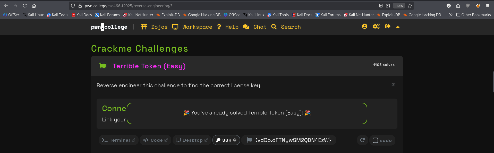

## hacker@reverse-engineering~terrible-token-easy:~$ strings /challenge/terrible-token-easy

```json
/lib64/ld-linux-x86-64.so.2
mgUa
libc.so.6
exit
puts
putchar
stdin
printf
__errno_location
read
memcmp
stdout
geteuid
open
__cxa_finalize
setvbuf
strerror
__libc_start_main
write
GLIBC_2.2.5
_ITM_deregisterTMCloneTable
__gmon_start__
_ITM_registerTMCloneTable
u+UH
[]A\A]A^A_
You win! Here is your flag:
/flag
  ERROR: Failed to open the flag -- %s!
  Your effective user id is not 0!
  You must directly run the suid binary in order to have the correct permissions!
  ERROR: Failed to read the flag -- %s!
### Welcome to %s!
This license verifier software will allow you to read the flag. However, before you can do so, you must verify that you
are licensed to read flag files! This program consumes a license key over stdin. Each program may perform entirely
different operations on that input! You must figure out (by reverse engineering this program) what that license key is.
Providing the correct license key will net you the flag!
Ready to receive your license key!
Initial input:
%02x 
The mangling is done! The resulting bytes will be used for the final comparison.
Final result of mangling input:
Expected result:
Checking the received license key!
Wrong! No flag for you!
:*3$"
yxfuc
GCC: (Ubuntu 9.4.0-1ubuntu1~20.04.2) 9.4.0
crtstuff.c
deregister_tm_clones
__do_global_dtors_aux
completed.8061
__do_global_dtors_aux_fini_array_entry
frame_dummy
__frame_dummy_init_array_entry
babyrev-level-1-0.c
flag_fd.5698
flag.5697
flag_length.5699
__FRAME_END__
__init_array_end
_DYNAMIC
__init_array_start
__GNU_EH_FRAME_HDR
_GLOBAL_OFFSET_TABLE_
__libc_csu_fini
putchar@@GLIBC_2.2.5
__errno_location@@GLIBC_2.2.5
_ITM_deregisterTMCloneTable
stdout@@GLIBC_2.2.5
puts@@GLIBC_2.2.5
stdin@@GLIBC_2.2.5
write@@GLIBC_2.2.5
_edata
printf@@GLIBC_2.2.5
geteuid@@GLIBC_2.2.5
read@@GLIBC_2.2.5
__libc_start_main@@GLIBC_2.2.5
memcmp@@GLIBC_2.2.5
__data_start
__gmon_start__
__dso_handle
_IO_stdin_used
__libc_csu_init
__bss_start
main
setvbuf@@GLIBC_2.2.5
open@@GLIBC_2.2.5
EXPECTED_RESULT
exit@@GLIBC_2.2.5
__TMC_END__
_ITM_registerTMCloneTable
strerror@@GLIBC_2.2.5
__cxa_finalize@@GLIBC_2.2.5
.symtab
.strtab
.shstrtab
.interp
.note.gnu.property
.note.gnu.build-id
.note.ABI-tag
.gnu.hash
.dynsym
.dynstr
.gnu.version
.gnu.version_r
.rela.dyn
.rela.plt
.init
.plt.got
.plt.sec
.text
.fini
.rodata
.eh_frame_hdr
.eh_frame
.init_array
.fini_array
.dynamic
.data
.bss
.comment
```


## hacker@reverse-engineering~terrible-token-easy:~$ /challenge/terrible-token-easy
```json

###
### Welcome to /challenge/terrible-token-easy!
###

This license verifier software will allow you to read the flag. However, before you can do so, you must verify that you
are licensed to read flag files! This program consumes a license key over stdin. Each program may perform entirely
different operations on that input! You must figure out (by reverse engineering this program) what that license key is.
Providing the correct license key will net you the flag!

Ready to receive your license key!


Initial input:

        0a 00 00 00 00 

The mangling is done! The resulting bytes will be used for the final comparison.

Final result of mangling input:

        0a 00 00 00 00 

Expected result:

        79 78 66 75 63 

Checking the received license key!

Wrong! No flag for you!
```
## hacker@reverse-engineering~terrible-token-easy:~$ ltrace /challenge/terrible-token-easy
```json

setvbuf(0x7d90b56a5980, nil, 2, 0)                                                              = 0
setvbuf(0x7d90b56a66a0, nil, 2, 0)                                                              = 0
puts("###"###
)                                                                                     = 4
printf("### Welcome to %s!\n", "/challenge/terrible-token-easy"### Welcome to /challenge/terrible-token-easy!
)                                = 47
puts("###"###
)                                                                                     = 4
putchar(10, 0x7d90b56a6723, 0, 0x7d90b55c7297
)                                                  = 10
puts("This license verifier software w"...This license verifier software will allow you to read the flag. However, before you can do so, you must verify that you
)                                                     = 120
puts("are licensed to read flag files!"...are licensed to read flag files! This program consumes a license key over stdin. Each program may perform entirely
)                                                     = 115
puts("different operations on that inp"...different operations on that input! You must figure out (by reverse engineering this program) what that license key is.
)                                                     = 120
puts("Providing the correct license ke"...Providing the correct license key will net you the flag!

)                                                     = 58
puts("Ready to receive your license ke"...Ready to receive your license key!

)                                                     = 36
read(0
, "\n", 5)                                                                                = 1
puts("Initial input:\n"Initial input:

)                                                                        = 16
putchar(9, 0x7d90b56a6723, 0, 0x7d90b55c7297    )                                                   = 9
printf("%02x ", 0xa0a )                                                                            = 3
printf("%02x ", 000 )                                                                              = 3
printf("%02x ", 000 )                                                                              = 3
printf("%02x ", 000 )                                                                              = 3
printf("%02x ", 000 )                                                                              = 3
puts("\n"

)                                                                                      = 2
puts("The mangling is done! The result"...The mangling is done! The resulting bytes will be used for the final comparison.

)                                                     = 82
puts("Final result of mangling input:\n"...Final result of mangling input:

)                                                    = 33
putchar(9, 0x7d90b56a6723, 0, 0x7d90b55c7297    )                                                   = 9
printf("%02x ", 0xa0a )                                                                            = 3
printf("%02x ", 000 )                                                                              = 3
printf("%02x ", 000 )                                                                              = 3
printf("%02x ", 000 )                                                                              = 3
printf("%02x ", 000 )                                                                              = 3
puts("\n"

)                                                                                      = 2
puts("Expected result:\n"Expected result:

)                                                                      = 18
putchar(9, 0x7d90b56a6723, 0, 0x7d90b55c7297    )                                                   = 9
printf("%02x ", 0x7979 )                                                                           = 3
printf("%02x ", 0x7878 )                                                                           = 3
printf("%02x ", 0x6666 )                                                                           = 3
printf("%02x ", 0x7575 )                                                                           = 3
printf("%02x ", 0x6363 )                                                                           = 3
puts("\n"

)                                                                                      = 2
puts("Checking the received license ke"...Checking the received license key!

)                                                     = 36
memcmp(0x7ffed8e611e2, 0x564dafe5b010, 5, 0x7d90b55c7297)                                       = 0xffffff91
puts("Wrong! No flag for you!"Wrong! No flag for you!
)                                                                 = 24
exit(1 <no return ...>
+++ exited (status 1) +++
```

## hacker@reverse-engineering~terrible-token-easy:~$ /challenge/terrible-token-easy
```json

###
### Welcome to /challenge/terrible-token-easy!
###

This license verifier software will allow you to read the flag. However, before you can do so, you must verify that you
are licensed to read flag files! This program consumes a license key over stdin. Each program may perform entirely
different operations on that input! You must figure out (by reverse engineering this program) what that license key is.
Providing the correct license key will net you the flag!

Ready to receive your license key!

%02x 
Initial input:

        25 30 32 78 20 

The mangling is done! The resulting bytes will be used for the final comparison.

Final result of mangling input:

        25 30 32 78 20 

Expected result:

        79 78 66 75 63 

Checking the received license key!

Wrong! No flag for you!
```
## hacker@reverse-engineering~terrible-token-easy:~$ printf 'yxfuc' | /challenge/terrible-token-easy
```json

###
### Welcome to /challenge/terrible-token-easy!
###

This license verifier software will allow you to read the flag. However, before you can do so, you must verify that you
are licensed to read flag files! This program consumes a license key over stdin. Each program may perform entirely
different operations on that input! You must figure out (by reverse engineering this program) what that license key is.
Providing the correct license key will net you the flag!

Ready to receive your license key!

Initial input:

        79 78 66 75 63 

The mangling is done! The resulting bytes will be used for the final comparison.

Final result of mangling input:

        79 78 66 75 63 

Expected result:

        79 78 66 75 63 

Checking the received license key!

You win! Here is your flag:
pwn.college{4TgdDujNwY2Yn7DaLvzA1sOvdDp.dFTNywSM2QDN4EzW}


```


## You’ve already reverse-engineered the important part. The key is **`yxfuc`**.

Why:

* The program reads **5 bytes**.
* Your `ltrace` shows `memcmp(..., 5)`.
* The mangling appears to leave the input unchanged.
* Expected bytes are:

```text
79 78 66 75 63
```

Those hex bytes translate to:

```text
79 = y
78 = x
66 = f
75 = u
63 = c
```

So provide exactly `yxfuc`.

Because the program reads exactly 5 bytes, use:

```bash
printf 'yxfuc' | /challenge/terrible-token-easy
```

You should get the flag.

