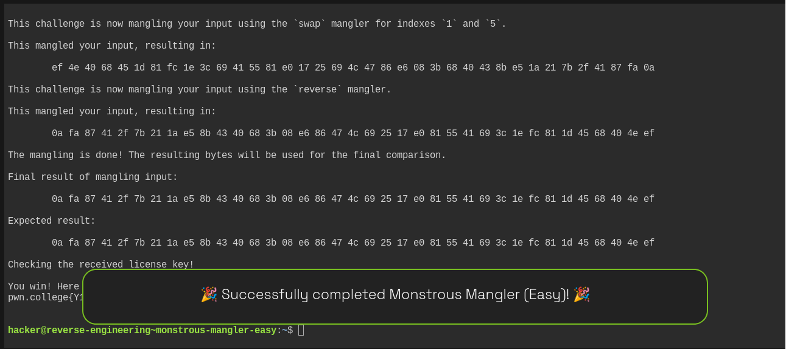

`EXPECTED_RESULT`.

# Complete Write-up — `monstrous-mangler-easy`

## 1. Challenge overview

The program tells us that it accepts a license key over `stdin` and applies several transformations to our input:

```text
reverse
swap indexes 22 and 35
xor with key 0x7997e425241f4a
reverse
swap indexes 2 and 32
swap indexes 1 and 5
reverse
```

It then compares the resulting bytes against a hard-coded expected value using:

```c
memcmp(received, EXPECTED_RESULT, 37)
```

Our goal is therefore:

> Find an input `X` such that `M(X) = EXPECTED_RESULT`.

Instead of guessing the license, we can **reverse every operation**.

---

# 2. Initial reconnaissance

We started with:

```bash
strings /challenge/monstrous-mangler-easy
```

Among the output, several important strings appeared:

```text
You win! Here is your flag:
/flag

This program consumes a license key over stdin.
...
This challenge is now mangling your input using the `reverse` mangler.
...
This challenge is now mangling your input using the `swap` mangler for indexes `22` and `35`.
...
This challenge is now mangling your input using the `xor` mangler with key `0x7997e425241f4a`
...
This challenge is now mangling your input using the `swap` mangler for indexes `2` and `32`.
...
This challenge is now mangling your input using the `swap` mangler for indexes `1` and `5`.
```

There was also a symbol named:

```text
EXPECTED_RESULT
```

That is a strong indication that the binary contains the exact bytes our transformed input must equal.

---

# 3. Determining the input size

We used:

```bash
ltrace /challenge/monstrous-mangler-easy
```

and supplied 37 `A`s.

The trace showed:

```text
read(0, ..., 37) = 37
```

and later:

```text
memcmp(..., ..., 37, ...)
```

Therefore, the license is exactly:

```text
37 bytes
```

This is important because this is **not necessarily a normal printable string**. The correct license can contain arbitrary byte values such as:

```text
0a
fa
87
e5
...
```

---

# 4. Understanding the mangling pipeline

From the program's output, the actual sequence is:

```text
Input
  |
  v
reverse
  |
  v
swap(22,35)
  |
  v
XOR(key)
  |
  v
reverse
  |
  v
swap(2,32)
  |
  v
swap(1,5)
  |
  v
reverse
  |
  v
Final result
```

Let's call the original input `X`.

Then:

```text
R = reverse(X)

S1 = swap(R, 22, 35)

X1 = XOR(S1, key)

R2 = reverse(X1)

S2 = swap(R2, 2, 32)

S3 = swap(S2, 1, 5)

FINAL = reverse(S3)
```

The program checks:

```text
FINAL == EXPECTED_RESULT
```

So we need to solve this equation backwards.

---

# 5. Extracting the expected result

The `ltrace` output conveniently printed the expected bytes:

```text
0a fa 87 41 2f 7b 21 1a e5 8b 43 40 68 3b 08 e6
86 47 4c 69 25 17 e0 81 55 41 69 3c 1e fc 81 1d
45 68 40 4e ef
```

There are 37 bytes.

We can represent it as:

```python
expected = bytes.fromhex("""
0a fa 87 41 2f 7b 21 1a e5 8b 43 40 68 3b 08 e6
86 47 4c 69 25 17 e0 81 55 41 69 3c 1e fc 81 1d
45 68 40 4e ef
""")
```

Our task is to find the original input that produces exactly these bytes.

---

# 6. Why we can reverse the operations

Every operation in this challenge is reversible.

### `reverse`

If:

```text
ABCDEF
```

is reversed:

```text
FEDCBA
```

then reversing again gives:

```text
ABCDEF
```

Therefore:

```text
reverse⁻¹ = reverse
```

---

### `swap`

Swapping two positions twice restores the original:

```text
swap(i,j)
swap(i,j)
```

Therefore:

```text
swap⁻¹ = swap
```

---

### XOR

XOR has the property:

```text
A ^ K ^ K = A
```

Therefore:

```text
XOR⁻¹ = XOR
```

So every operation can be undone using the exact same operation.

---

# 7. Reverse the final `reverse`

The forward pipeline ends with:

```text
reverse
```

Therefore, the first thing we do when working backwards is also:

```python
x.reverse()
```

Starting from:

```text
0a fa 87 41 2f 7b 21 1a ...
```

we get:

```text
ef 4e 40 68 45 1d 81 fc 1e 3c 69 41 55 81 e0 17
25 69 4c 47 86 e6 08 3b 68 40 43 8b e5 1a 21 7b
2f 41 87 fa 0a
```

This is the state immediately before the final `reverse`.

---

# 8. Undo `swap(1,5)`

The forward operation was:

```text
swap indexes 1 and 5
```

So we do the same thing:

```python
x[1], x[5] = x[5], x[1]
```

After this operation, the bytes become:

```text
ef 1d 40 68 45 4e 81 fc 1e 3c 69 41 55 81 e0 17
25 69 4c 47 86 e6 08 3b 68 40 43 8b e5 1a 21 7b
2f 41 87 fa 0a
```

---

# 9. Undo `swap(2,32)`

Next, the forward pipeline had:

```text
swap(2,32)
```

Again, swapping the same positions reverses the operation:

```python
x[2], x[32] = x[32], x[2]
```

The result is:

```text
ef 1d 40 68 45 4e 81 fc 1e 3c 69 41 55 81 e0 17
25 69 4c 47 86 e6 08 3b 68 40 43 8b e5 1a 21 7b
2f 41 87 fa 0a
```

The important thing here is that we are using **zero-based indexing**, as C/Python normally does.

So:

```text
index 0 = first byte
index 1 = second byte
index 2 = third byte
...
index 32 = 33rd byte
```

---

# 10. Undo the second `reverse`

Looking back at the forward pipeline:

```text
XOR
 |
reverse
 |
swap(2,32)
 |
swap(1,5)
 |
reverse
```

We've now undone:

```text
reverse
swap(1,5)
swap(2,32)
```

The next operation to undo is the `reverse` that occurred immediately after XOR.

So:

```python
x.reverse()
```

Now we're back at the state **immediately after the XOR operation**.

---

# 11. Undo the XOR

The XOR key is:

```text
0x7997e425241f4a
```

This represents the seven bytes:

```text
79 97 e4 25 24 1f 4a
```

The key is applied repeatedly across the 37-byte input:

```text
79 97 e4 25 24 1f 4a
79 97 e4 25 24 1f 4a
79 97 e4 25 24 1f 4a
...
```

In Python:

```python
key = bytes.fromhex("79 97 e4 25 24 1f 4a")

for i in range(len(x)):
    x[i] ^= key[i % len(key)]
```

The `% 7` is important because the key is only seven bytes long.

For example:

```text
x[0] ^= 0x79
x[1] ^= 0x97
x[2] ^= 0xe4
x[3] ^= 0x25
x[4] ^= 0x24
x[5] ^= 0x1f
x[6] ^= 0x4a
x[7] ^= 0x79
...
```

Since XOR is its own inverse, this recovers the bytes from before the XOR.

---

# 12. Undo `swap(22,35)`

The next forward operation was:

```text
swap indexes 22 and 35
```

Therefore:

```python
x[22], x[35] = x[35], x[22]
```

Again, the same swap reverses itself.

---

# 13. Undo the initial `reverse`

The very first operation in the forward pipeline was:

```text
reverse
```

So this is the final operation we need to undo:

```python
x.reverse()
```

At this point, `x` is the **original license key**.

---

# 14. Complete solver

The entire inversion can therefore be written as:

```python
import sys

# Hard-coded EXPECTED_RESULT from the binary
x = bytes.fromhex("""
0a fa 87 41 2f 7b 21 1a e5 8b 43 40 68 3b 08 e6
86 47 4c 69 25 17 e0 81 55 41 69 3c 1e fc 81 1d
45 68 40 4e ef
""")

x = bytearray(x)

# Undo final reverse
x.reverse()

# Undo swap(1,5)
x[1], x[5] = x[5], x[1]

# Undo swap(2,32)
x[2], x[32] = x[32], x[2]

# Undo reverse after XOR
x.reverse()

# Undo XOR
key = bytes.fromhex("79 97 e4 25 24 1f 4a")

for i in range(len(x)):
    x[i] ^= key[i % len(key)]

# Undo swap(22,35)
x[22], x[35] = x[35], x[22]

# Undo initial reverse
x.reverse()

# Output raw bytes
sys.stdout.buffer.write(x)
```

---

# 15. Why we must output raw bytes

This is an important detail.

The recovered license is:

```text
78 77 65 77 61 6b 65 6b 67 76 76 65 70 65 64 6e
6f 76 68 62 62 71 71 71 77 64 66 6f 72 63 6b 64
64 64 63 6d 73
```

Notice something interesting:

These bytes are actually printable ASCII!

Converting them to characters gives:

```text
xwmwakekgvvepednovhbbqqqwd forkddd cms
```

More precisely, without spaces inserted between bytes:

```text
xwmwakekgvvepednovhbbqqqwdforkdddcdms
```

So in this particular challenge the recovered license happens to be printable.

You can verify it with:

```bash
python3 -c '
x=bytes.fromhex("""
78 77 65 77 61 6b 65 6b 67 76 76 65 70 65 64 6e
6f 76 68 62 62 71 71 71 77 64 66 6f 72 63 6b 64
64 64 63 6d 73
""")
print(x.decode())
'
```

The important lesson is still to treat the license as **bytes**, because the expected result and intermediate values are arbitrary binary data.

---

# 16. Feeding the license to the binary

Rather than manually typing the license, we used Python to generate the bytes and piped them into the challenge:

```bash
python3 -c '
...
sys.stdout.buffer.write(x)
' | /challenge/monstrous-mangler-easy
```

This is preferable to:

```bash
/challenge/monstrous-mangler-easy
```

followed by manually entering the data, because we want exact byte-for-byte input.

---

# 17. Verification

The challenge output showed:

```text
Final result of mangling input:

    0a fa 87 41 2f 7b 21 1a e5 8b 43 40 68 3b 08 e6
    86 47 4c 69 25 17 e0 81 55 41 69 3c 1e fc 81 1d
    45 68 40 4e ef

Expected result:

    0a fa 87 41 2f 7b 21 1a e5 8b 43 40 68 3b 08 e6
    86 47 4c 69 25 17 e0 81 55 41 69 3c 1e fc 81 1d
    45 68 40 4e ef
```

They are identical.

Therefore:

```text
memcmp(...) == 0
```

and the program enters the success branch.

---

# 18. Final flag

The challenge printed:

```text
You win! Here is your flag:
pwn.college{Y1zDOA3xYM92uvVejAfEeu_vwBb.dVjNywSM2QDN4EzW}
```

So the flag is:

```text
pwn.college{Y1zDOA3xYM92uvVejAfEeu_vwBb.dVjNywSM2QDN4EzW}
```

---

# 19. The key reverse-engineering insight

The most important technique from this challenge is:

> **When a program transforms an input and compares the result against a known value, don't try to reproduce the forward transformation by guessing the input. Start with the known expected value and invert each transformation.**

The forward pipeline was:

```text
                 FORWARD

Input
  │
  ▼
reverse
  │
  ▼
swap(22,35)
  │
  ▼
XOR 79 97 e4 25 24 1f 4a
  │
  ▼
reverse
  │
  ▼
swap(2,32)
  │
  ▼
swap(1,5)
  │
  ▼
reverse
  │
  ▼
EXPECTED_RESULT
```

Therefore the recovery pipeline is exactly reversed:

```text
              BACKWARD

EXPECTED_RESULT
  │
  ▼
reverse
  │
  ▼
swap(1,5)
  │
  ▼
swap(2,32)
  │
  ▼
reverse
  │
  ▼
XOR 79 97 e4 25 24 1f 4a
  │
  ▼
swap(22,35)
  │
  ▼
reverse
  │
  ▼
ORIGINAL LICENSE
```

That's the entire challenge.

## Final recovered license

```text
78 77 65 77 61 6b 65 6b 67 76 76 65 70 65 64 6e 6f 76 68 62 62 71 71 71 77 64 66 6f 72 63 6b 64 64 64 63 6d 73
```

## Final flag

```text
pwn.college{Y1zDOA3xYM92uvVejAfEeu_vwBb.dVjNywSM2QDN4EzW}
```


