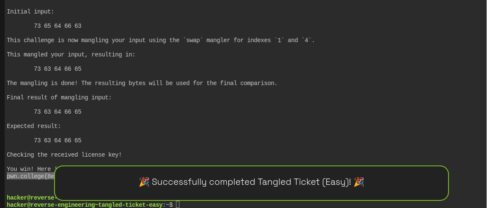

# Tangled Ticket Easy — Reverse Engineering Walkthrough

## Challenge

Binary:

```bash
/challenge/tangled-ticket-easy
```

The goal is to reverse engineer the license verification logic and determine the correct 5-byte license key.

---

## 1. Initial Investigation with `ltrace`

Run:

```bash
ltrace /challenge/tangled-ticket-easy
```

The important part of the output is:

```text
read(0, "\n", 5) = 1
...
This challenge is now mangling your input using the `swap` mangler for indexes `1` and `4`.
...
Expected result:
    7373 6363 6464 6666 6565
...
memcmp(..., ..., 5, ...) = ...
```

This tells us:

* The program reads up to **5 bytes** from stdin.
* The input is transformed using a `swap` operation.
* The swap occurs between indexes **1 and 4**.
* The final transformed value is compared using `memcmp()`.
* `memcmp()` compares exactly **5 bytes**.

---

## 2. Finding the Expected Result

The program prints the expected values using:

```c
printf("%02x ", value);
```

The relevant output is:

```text
7373 6363 6464 6666 6565
```

Although these appear as larger hexadecimal values, the important part is the low byte of each value.

The five expected bytes are:

```text
73 63 64 66 65
```

Convert them to ASCII:

```text
73 = s
63 = c
64 = d
66 = f
65 = e
```

Therefore, the final mangled result must be:

```text
scdfe
```

---

## 3. Understanding the Mangling Operation

The program explicitly tells us:

```text
This challenge is now mangling your input using the `swap` mangler for indexes `1` and `4`.
```

The indexes are zero-based:

```text
Index:  0 1 2 3 4
```

We know the **result after mangling** must be:

```text
s c d f e
```

So:

```text
Index:  0 1 2 3 4
Value:  s c d f e
```

The mangler swaps indexes `1` and `4`.

To recover the original input, simply perform the same swap again:

```text
Before swap:
s c d f e

Swap indexes 1 and 4:

s e d f c
```

Therefore the original license key is:

```text
sedfc
```

---

## 4. Verifying the Key

Run:

```bash
printf 'sedfc' | /challenge/tangled-ticket-easy
```

The transformation is:

```text
Input:
sedfc

Indexes:
0 1 2 3 4
s e d f c

Swap indexes 1 and 4:

s c d f e

Result:
scdfe
```

The result matches the expected bytes:

```text
scdfe
```

Therefore `memcmp()` returns zero and the license verification succeeds.

---

## 5. Useful `strings` Findings

Running:

```bash
strings /challenge/tangled-ticket-easy
```

reveals several useful strings:

```text
You win! Here is your flag:
/flag
...
This challenge is now mangling your input using the `swap` mangler for indexes `1` and `4`.
...
Expected result:
...
Checking the received license key!
Wrong! No flag for you!
```

It also reveals:

```text
EXPECTED_RESULT
```

which is a useful indication that the expected comparison value is stored in the binary.

The source filename is also visible:

```text
babyrev-level-2-0.c
```

This confirms that the challenge is intentionally designed around a simple reverse-engineering transformation.

---

## 6. Why the `ltrace` Output Is Useful

The most important clues from `ltrace` are:

```text
read(0, ..., 5)
```

and:

```text
memcmp(..., ..., 5)
```

The first tells us the license is only **5 bytes** long.

The second tells us the final verification compares exactly **5 bytes**.

The program then explicitly describes the transformation:

```text
swap indexes 1 and 4
```

So there is no need to brute-force the key. We can simply reverse the transformation.

---

## 7. Solving the Challenge

The complete reasoning is:

```text
Expected final bytes:
73 63 64 66 65

ASCII:
s c d f e

Expected mangled result:
scdfe

Mangler:
swap indexes 1 and 4

Reverse the swap:
s e d f c

License key:
sedfc
```

---

## Final Answer

The correct license key is:

```text
sedfc
```

Verify with:

```bash
printf 'sedfc' | /challenge/tangled-ticket-easy
```

The key `sedfc` is transformed into `scdfe`, which matches the expected result and allows the program to proceed to the flag.


``hacker@reverse-engineering~tangled-ticket-easy:~$ printf 'sedfc' | /challenge/tangled-ticket-easy
###
### Welcome to /challenge/tangled-ticket-easy!
###

This license verifier software will allow you to read the flag. However, before you can do so, you must verify that you
are licensed to read flag files! This program consumes a license key over stdin. Each program may perform entirely
different operations on that input! You must figure out (by reverse engineering this program) what that license key is.
Providing the correct license key will net you the flag!

Ready to receive your license key!

Initial input:

        73 65 64 66 63 

This challenge is now mangling your input using the `swap` mangler for indexes `1` and `4`.

This mangled your input, resulting in:

        73 63 64 66 65 

The mangling is done! The resulting bytes will be used for the final comparison.

Final result of mangling input:

        73 63 64 66 65 

Expected result:

        73 63 64 66 65 

Checking the received license key!

You win! Here is your flag:
pwn.college{8eLElwsdyeEJnicMhOXg-f2kang.dNTNywSM2QDN4EzW}


``


