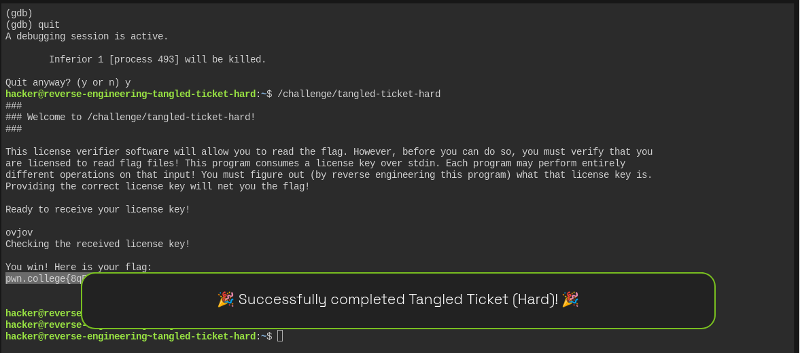

# Tangled Ticket Hard — Reverse Engineering Walkthrough

## Challenge

Binary:

```bash
/challenge/tangled-ticket-hard
```

The goal is to reverse engineer the license verification logic and determine the correct 5-byte license key.

---

## 1. Initial Investigation with `ltrace`

Start by running:

```bash
ltrace /challenge/tangled-ticket-hard
```

The important part of the output was:

```text
read(0, ..., 5) = 1
...
memcmp(0x7ffeff937642, 0x63faa19bc010, 5, ...) = 0xffffff8a
```

This tells us several things:

* The program reads input from standard input.
* The `read()` call has a maximum length of **5 bytes**.
* The program eventually calls `memcmp()`.
* `memcmp()` compares exactly **5 bytes**.

The first attempt only supplied a newline, so the comparison failed.

This suggests that the license key is exactly five bytes long.

---

## 2. Inspecting the `memcmp()` Arguments

Because `ltrace` shows that `memcmp()` is being used, we can inspect its arguments with `gdb`.

Start GDB:

```bash
gdb -q /challenge/tangled-ticket-hard
```

Set a breakpoint on `memcmp`:

```gdb
break memcmp
```

Then run the program:

```gdb
run
```

When prompted for the license key, initially enter:

```text
AAAAA
```

On x86-64 Linux, the first three function arguments are passed in:

```text
RDI = first argument
RSI = second argument
RDX = third argument
```

For:

```c
memcmp(a, b, 5)
```

that means:

```text
RDI = a
RSI = b
RDX = 5
```

We can inspect them with:

```gdb
p/x $rdx
x/5bx $rdi
x/5bx $rsi
```

---

## 3. Discovering the Expected Value

The second buffer contained:

```text
0x76 0x6f 0x6a 0x6f 0x76
```

Convert those hexadecimal byte values to ASCII:

```text
0x76 = v
0x6f = o
0x6a = j
0x6f = o
0x76 = v
```

Therefore the value being compared against is:

```text
vojov
```

At first, it looks like `vojov` should simply be the license key.

However, entering `vojov` produced an interesting result.

---

## 4. Discovering the Input Transformation

Run the program again under GDB:

```bash
gdb -q /challenge/tangled-ticket-hard
```

Set the breakpoint:

```gdb
break memcmp
run
```

Enter:

```text
vojov
```

When execution stops inside `memcmp`, inspect the arguments:

```gdb
p/x $rdx
x/5bx $rdi
x/5bx $rsi
```

The result was:

```text
$rdx = 0x5
```

The first buffer:

```text
0x7ffe89e4c592:
0x6f 0x76 0x6a 0x6f 0x76
```

The second buffer:

```text
0x5a1808e33010:
0x76 0x6f 0x6a 0x6f 0x76
```

Converting to ASCII:

```text
RDI: o v j o v
RSI: v o j o v
```

So the program is **not comparing our input directly**.

Instead:

```text
Input:       v o j o v
             ↓
Transformation
             ↓
Compared:    o v j o v
```

The first two characters are swapped.

---

## 5. Reversing the Transformation

The verifier performs:

```text
input[0] ↔ input[1]
```

while the remaining characters stay unchanged.

The expected transformed value is:

```text
v o j o v
```

We need to find the original input that becomes this after the swap.

Let the original input be:

```text
a b c d e
```

After swapping the first two bytes:

```text
b a c d e
```

We need:

```text
b a c d e
=
v o j o v
```

Therefore:

```text
b = v
a = o
c = j
d = o
e = v
```

So the original input must be:

```text
o v j o v
```

or:

```text
ovjov
```

---

## 6. Final License Key

The correct license key is:

```text
ovjov
```

Run:

```bash
/challenge/tangled-ticket-hard
```

and enter:

```text
ovjov
```

The program transforms it:

```text
ovjov
 ↓
vojov
```

and then compares it with the expected value:

```text
vojov
```

The `memcmp()` therefore returns:

```text
0
```

which means the license verification succeeds.

---

## 7. Useful GDB Commands

The following commands were particularly useful during the analysis.

### Set a breakpoint on `memcmp`

```gdb
break memcmp
```

### Start the program

```gdb
run
```

### Inspect the comparison length

```gdb
p/x $rdx
```

Expected:

```text
0x5
```

### Inspect the first buffer

```gdb
x/5bx $rdi
```

### Inspect the second buffer

```gdb
x/5bx $rsi
```

### Display bytes as characters

```gdb
x/5cb $rdi
x/5cb $rsi
```

### Continue execution

```gdb
continue
```

---

## 8. Why `ltrace` Alone Wasn't Enough

`ltrace` showed us:

```text
memcmp(..., ..., 5)
```

but it did not directly reveal the contents of the buffers in a convenient way.

The important clue was that `memcmp()` compares two different memory locations.

GDB allowed us to inspect those locations directly through the x86-64 calling convention:

```text
RDI → first memcmp argument
RSI → second memcmp argument
RDX → comparison length
```

This exposed both:

```text
transformed user input
```

and:

```text
expected value
```

Comparing the two revealed the byte swap.

---

## 9. Final Analysis

The reverse-engineering process was:

```text
ltrace
  │
  ├── read() → 5-byte input
  │
  └── memcmp(..., ..., 5)
             │
             ▼
           GDB
             │
             ├── RDI → transformed input
             │
             └── RSI → expected bytes
                         │
                         ▼
                       "vojov"
```

We then discovered:

```text
Input:       vojov
Transformed: ovjov
Expected:    vojov
```

Therefore the inverse transformation is required:

```text
Expected:    vojov
Inverse:     swap first two bytes
             ↓
License:     ovjov
```

### Final Answer

```text
ovjov
```

The key lesson is that finding the expected bytes in memory is not always enough. You must compare the **input buffer (`RDI`)** with the **expected buffer (`RSI`)** at the verification point. If they differ, that difference often reveals the transformation that must be reversed.

```json
pwn.college{8qFyeimu_zhAjI2_Im9o6Zdrx7i.dRTNywSM2QDN4EzW}
```





#### OFF topic Discussion :


Absolutely. This is one of the most important concepts for understanding GDB and reverse engineering.

## 1. What are `RDI`, `RSI`, and `RDX`?

They are **CPU registers** on x86-64 Linux.

A register is a small, very fast storage location inside the CPU. Programs use registers to hold things like:

* function arguments
* return values
* addresses/pointers
* temporary calculations

On 64-bit Linux, a common calling convention is called **System V AMD64 ABI**. It specifies where function arguments are placed before a function is called.

For the first six integer/pointer arguments, it uses:

```text
1st argument → RDI
2nd argument → RSI
3rd argument → RDX
4th argument → RCX
5th argument → R8
6th argument → R9
```

So if C code says:

```c
memcmp(a, b, 5);
```

the CPU will normally have:

```text
RDI → a
RSI → b
RDX → 5
```

That's why we inspect those registers.

---

# 2. What is `memcmp()`?

`memcmp()` compares two blocks of memory.

Its C definition is essentially:

```c
memcmp(pointer1, pointer2, number_of_bytes);
```

For example:

```c
char a[] = "hello";
char b[] = "hello";

memcmp(a, b, 5);
```

means:

> Compare 5 bytes starting at `a` with 5 bytes starting at `b`.

Conceptually:

```text
a:  h  e  l  l  o
   ↓
   memory address

b:  h  e  l  l  o
   ↓
   memory address
```

If they are identical, `memcmp()` returns:

```text
0
```

If they differ, it returns a nonzero value.

---

# 3. So what exactly is in `RDI`?

This is the important part.

Suppose we have:

```c
char input[] = "ovjov";
char expected[] = "vojov";

memcmp(input, expected, 5);
```

The function call conceptually looks like:

```text
memcmp(
    input,
    expected,
    5
)
```

Before `memcmp()` executes, the CPU registers contain approximately:

```text
RDI = address of input
RSI = address of expected
RDX = 5
```

Notice something important:

**RDI doesn't contain the characters themselves.**

It contains an **address**.

For example:

```text
RDI = 0x7ffe89e4c592
```

That means:

> Go to memory address `0x7ffe89e4c592`.

At that address you might find:

```text
0x6f  0x76  0x6a  0x6f  0x76
```

which is:

```text
o     v     j     o     v
```

So:

```text
RDI
 │
 │ points to
 ▼
0x7ffe89e4c592
 │
 ├── 0x6f = 'o'
 ├── 0x76 = 'v'
 ├── 0x6a = 'j'
 ├── 0x6f = 'o'
 └── 0x76 = 'v'
```

That's why we use a memory examination command on `$rdi`.

---

# 4. What does `RSI` contain?

Same idea.

For:

```c
memcmp(input, expected, 5);
```

`RSI` contains the address of `expected`.

For example:

```text
RSI = 0x5a1808e33010
```

At that address:

```text
0x76  0x6f  0x6a  0x6f  0x76
```

which is:

```text
v     o     j     o     v
```

So:

```text
RSI
 │
 │ points to
 ▼
0x5a1808e33010
 │
 ├── 0x76 = 'v'
 ├── 0x6f = 'o'
 ├── 0x6a = 'j'
 ├── 0x6f = 'o'
 └── 0x76 = 'v'
```

---

# 5. What does `RDX` mean here?

`RDX` contains the **third argument**.

We have:

```c
memcmp(a, b, 5);
```

Therefore:

```text
1st argument → RDI → a
2nd argument → RSI → b
3rd argument → RDX → 5
```

So when you typed:

```gdb
p/x $rdx
```

and got:

```text
$1 = 0x5
```

we learned:

```text
memcmp(..., ..., 5)
```

is comparing **5 bytes**.

The `0x` means hexadecimal.

```text
0x5 = 5
```

---

# 6. Why did we use these commands?

This is the key question.

We stopped execution at:

```text
Breakpoint 1.1, __memcmp_sse4_1 ()
```

At this exact moment, the program is about to perform the comparison.

We want to answer three questions:

### Question 1: How many bytes are being compared?

Use:

```gdb
p/x $rdx
```

Result:

```text
0x5
```

Therefore:

```text
5 bytes
```

---

### Question 2: What is the first thing being compared?

Use:

```gdb
x/5bx $rdi
```

This means:

```text
x       examine memory
/5      examine 5 items
b       each item is 1 byte
x       display in hexadecimal
```

So:

```gdb
x/5bx $rdi
```

means:

> Examine 5 bytes of memory starting at the address stored in RDI, and display them as hexadecimal.

You got:

```text
0x6f  0x76  0x6a  0x6f  0x76
```

ASCII:

```text
o     v     j     o     v
```

Therefore the **transformed input** was:

```text
ovjov
```

---

### Question 3: What is the second thing being compared?

Use:

```gdb
x/5bx $rsi
```

You got:

```text
0x76  0x6f  0x6a  0x6f  0x76
```

ASCII:

```text
v     o     j     o     v
```

Therefore the **expected value** was:

```text
vojov
```

Now we can see:

```text
RDI → ovjov
RSI → vojov
```

And that's how we discovered that the program had changed the input before calling `memcmp()`.

---

# 7. Why `x/5bx` instead of just `p $rdi`?

Because `$rdi` contains an **address**, not the actual string.

If you do:

```gdb
p/x $rdi
```

you might get:

```text
$1 = 0x7ffe89e4c592
```

That's only the address.

It doesn't tell us what's stored there.

So we say:

```gdb
x/5bx $rdi
```

which means:

> Go to the address stored in RDI and show me 5 bytes from there.

Think of it like this:

```text
RDI
 │
 │ contains address
 ▼
0x7ffe89e4c592
 │
 │ examine this memory
 ▼
6f 76 6a 6f 76
```

---

# 8. And what does `x/5cb` mean?

You also used:

```gdb
x/5cb $rdi
```

Here:

```text
x   = examine memory
5   = 5 items
c   = character
b   = byte
```

This displays the bytes as characters.

So instead of:

```text
0x6f  0x76  0x6a  0x6f  0x76
```

you get:

```text
'o'  'v'  'j'  'o'  'v'
```

It's just a more human-friendly way of looking at the same memory.

---

# 9. The whole thing visually

For your challenge, at the breakpoint we effectively had:

```text
                 memcmp()
                    │
        ┌───────────┼───────────┐
        │           │           │
       RDI         RSI         RDX
        │           │           │
        ▼           ▼           ▼
     address     address         5
        │           │
        ▼           ▼
     "ovjov"     "vojov"
        │           │
        └─────┬─────┘
              │
           compare
              │
              ▼
          not equal
```

And that is exactly why inspecting the registers was useful.

## The big reverse-engineering lesson

Whenever you hit a function such as:

```c
strcmp(a, b)
memcmp(a, b, n)
strcpy(dst, src)
memcpy(dst, src, n)
```

you should think:

> **What are the function arguments right now?**

On x86-64 Linux, the first three are usually:

```text
RDI → argument 1
RSI → argument 2
RDX → argument 3
```

So for:

```c
memcmp(a, b, 5)
```

you immediately know to investigate:

```gdb
x/5bx $rdi
x/5bx $rsi
p/x $rdx
```

That technique is extremely useful for license-checker and reverse-engineering challenges.
