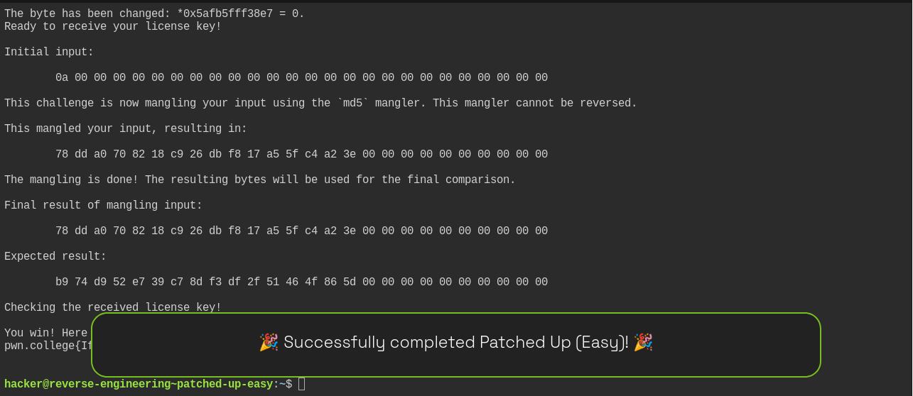

## Write-up: `patched-up-easy`

### 1. Understand the challenge

The program says the license key is mangled with MD5 and that the key cannot be reversed.

Instead of trying to crack the MD5, the important clue is:

```text
Changing byte 1/5.
Offset (hex) to change:
New value (hex):
```

The program gives us **five arbitrary byte modifications** to its own memory.

So the goal is to reverse-engineer the program and find a useful instruction to patch.

---

### 2. Inspect the binary

First, inspect the strings:

```bash
strings /challenge/patched-up-easy
```

Among the output are:

```text
You win! Here is your flag:
/flag
...
This program consumes a license key over stdin.
...
This challenge is now mangling your input using the `md5` mangler.
...
Final result of mangling input:
Expected result:
Checking the received license key!
Wrong! No flag for you!
```

This tells us that the program eventually compares our mangled input against an expected value.

---

### 3. Disassemble `main`

Use:

```bash
objdump -d -M intel /challenge/patched-up-easy | sed -n '/<main>:/,/^$/p'
```

Near the end of `main`, we find:

```asm
28c9: lea    rax,[rbp-0x30]
28cd: mov    edx,0x1a
28d2: lea    rsi,[rip+0x2737]        # 5010 <EXPECTED_RESULT>
28d9: mov    rdi,rax
28dc: call   1250 <memcmp@plt>

28e1: test   eax,eax
28e3: jne    28f9

28e5: mov    eax,0
28ea: call   233c <win>
```

This is the key part.

In C-like pseudocode, it is essentially:

```c
if (memcmp(mangled_input, EXPECTED_RESULT, 0x1a) != 0) {
    puts("Wrong! No flag for you!");
    exit(1);
}

win();
```

Therefore, we don't actually need to discover the license key.

---

### 4. Find the conditional branch

The important instruction is:

```asm
28e3: jne 28f9
```

`jne` means **jump if not equal**.

After `memcmp()`:

* `eax == 0` → the values match → don't jump → `win()`
* `eax != 0` → values don't match → jump to failure

We can bypass this entire check by replacing the two-byte `jne` instruction with two NOPs.

The original bytes are:

```text
75 14
```

We change them to:

```text
90 90
```

`0x90` is the x86 NOP instruction.

So the code becomes:

```asm
28e1: test eax,eax
28e3: nop
28e4: nop
28e5: mov eax,0
28ea: call 233c <win>
```

Now execution always falls through to `win()`.

---

### 5. Determine the correct patch offsets

We need to make sure the challenge's offsets correspond to the file offsets.

Run:

```bash
readelf -S /challenge/patched-up-easy | grep -E '\.text|\.rodata'
```

The result was:

```text
[16] .text     PROGBITS     0000000000001280  00001280
[18] .rodata   PROGBITS     0000000000003000  00003000
```

The `.text` section has:

```text
Virtual address = 0x1280
File offset     = 0x1280
```

Therefore, the instruction at address `0x28e3` corresponds to file offset `0x28e3`.

---

### 6. Why five changes?

The challenge requires exactly five byte changes.

Only the first two need to actually change:

```text
28e3: 75 -> 90
28e4: 14 -> 90
```

For the other three, we can simply write the bytes they already contain:

```text
28e5: b8 -> b8
28e6: 00 -> 00
28e7: 00 -> 00
```

Thus our five modifications are:

```text
Offset    New value
28e3      90
28e4      90
28e5      b8
28e6      00
28e7      00
```

---

### 7. Apply the patch

Run the SUID binary **directly**, not through GDB:

```bash
/challenge/patched-up-easy
```

Enter:

```text
Changing byte 1/5.
Offset (hex) to change: 28e3
New value (hex): 90

Changing byte 2/5.
Offset (hex) to change: 28e4
New value (hex): 90

Changing byte 3/5.
Offset (hex) to change: 28e5
New value (hex): b8

Changing byte 4/5.
Offset (hex) to change: 28e6
New value (hex): 00

Changing byte 5/5.
Offset (hex) to change: 28e7
New value (hex): 00
```

---

### 8. Provide any 26-byte input

The disassembly shows:

```asm
26a3: mov edx,0x1a
26b0: call read
```

`0x1a` is decimal **26**, so the program reads 26 bytes.

Because we bypassed the comparison, the actual license key doesn't matter.

For example:

```text
AAAAAAAAAAAAAAAAAAAAAAAAAA
```

is 26 bytes.

In your successful run, you instead supplied input beginning with:

```text
0a 00 00 00 ...
```

and it still worked, proving that the actual MD5 result was irrelevant after the patch.

---

### 9. Why running directly matters

Your first attempt through GDB produced:

```text
ERROR: Failed to open the flag -- Permission denied!
Your effective user id is not 0!
You must directly run the suid binary
```

That happened because the challenge binary is SUID.

The final execution needs to be:

```bash
/challenge/patched-up-easy
```

rather than:

```bash
gdb /challenge/patched-up-easy
```

Once run directly, the binary retains its effective UID of 0 and `win()` can open `/flag`.

---

### 10. Final result

The important insight is:

> **Don't crack the MD5. Patch the conditional branch that checks the MD5 result.**

The original:

```asm
test eax,eax
jne 28f9
mov eax,0
call win
```

becomes:

```asm
test eax,eax
nop
nop
mov eax,0
call win
```

Therefore the program always reaches `win()`, regardless of the supplied license key.

Your successful flag was:

```text
pwn.college{IfTHER-O_Owy_QPbVnlSLMflEqy.ddjNywSM2QDN4EzW}
```

### Short solution summary

```text
1. strings /challenge/patched-up-easy
2. objdump -d -M intel ... → inspect main
3. Find memcmp() near 0x28dc
4. Find:
       28e3: jne 28f9
5. Check .text offset with readelf -S
6. Patch:
       28e3 → 90
       28e4 → 90
       28e5 → b8
       28e6 → 00
       28e7 → 00
7. Run the SUID binary directly.
8. Supply any 26-byte input.
9. The comparison is bypassed and win() prints the flag.
```


